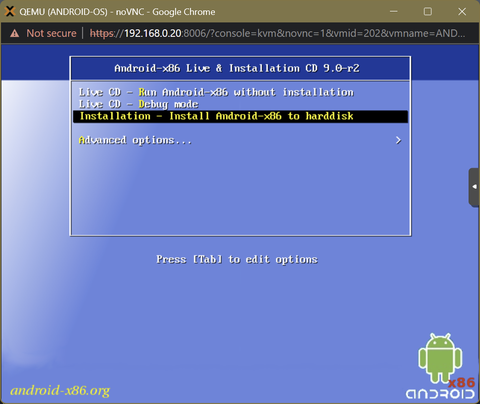
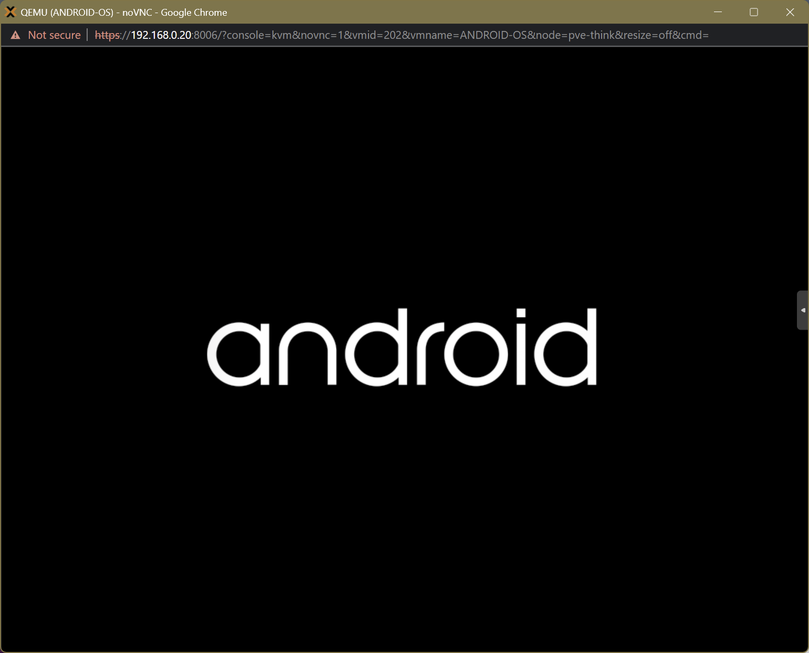
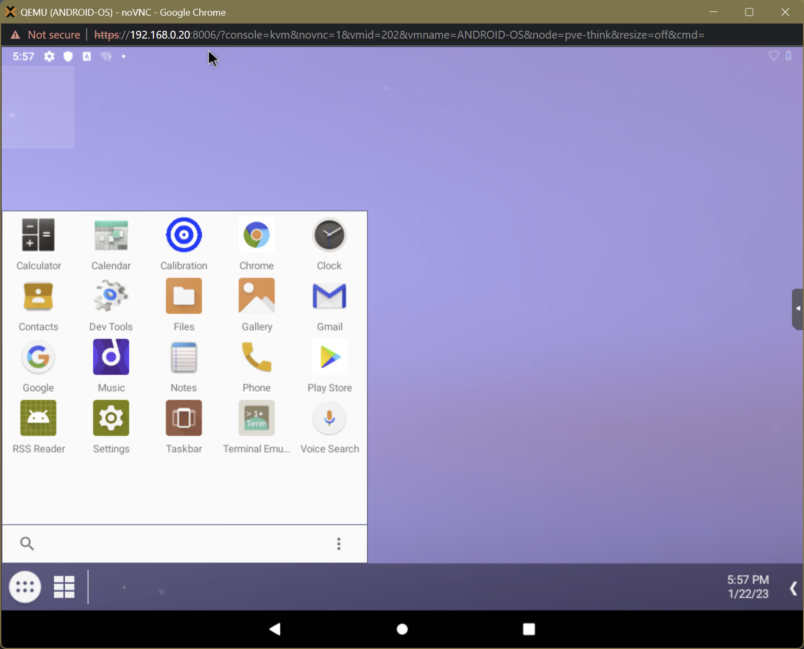

# 011. ProxMox ➡️ Android OS

## Links

- [Android OS ISO](https://www.fosshub.com/Android-x86.html)

## Installation

- **Download Android OS** from [here](https://www.fosshub.com/Android-x86.html?dwl=android-x86_64-9.0-r2.iso):
- **Upload** the ISO to the Proxmox machine.
- **Create** a new **VM** (*select iso, 64GB disk size, 4096 RAM*):
- **Start** the VM
- Select **Installation - Install Android-x86 to harddisk**
   
- **Create**/Modify **partitions** (*no GPT*)
    - New
    - Primairy
    - Size: 64GB
    - Bootable
    - Write (yes)
    - Quit
- OK
- **Format** to **ext4** (*Yes*)
- **GRUB → Yes**
- Say **No** to **install `/system` read-write**
- **Run** Android-x86
   

## Setup

- **Language**: English → Start
- **Skip** Connect to **Wi-Fi → Continue**
- Set **Timezone** and Date Format
- Disable **Location** Options
- **Protect** your tablet with whatever you want (*Pattern, PIN, Password*)
- Select a **Home** app: **Taskbar** → Always
       
- Navigate to **Settings** → Finish setting up your device
- **Wi-Fi** Settings → **VirtWifi**
- Start → Don’t Copy
- **Login** into your account (*or create a new account*) → I agree
- Don’t Back up → Accept → No Thanks → No Thanks

## Finish

- Set **Keyboard** Layout
- Navigate to the **Play Store** and **Update** All Apps
- Update **Google Play services**