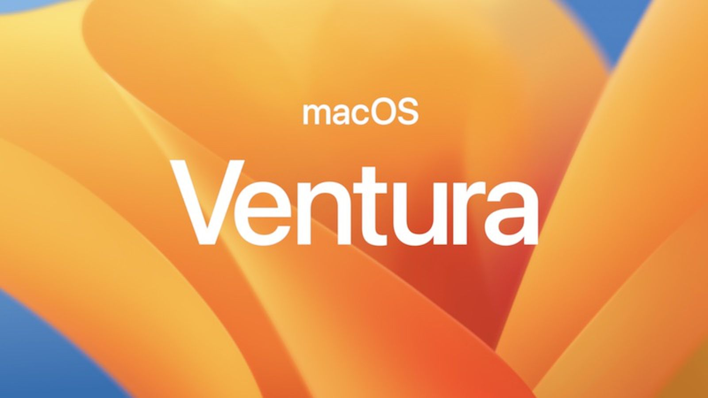
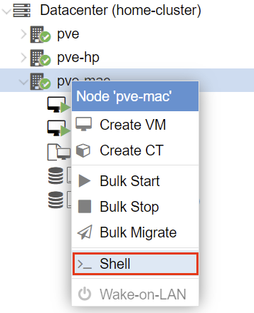
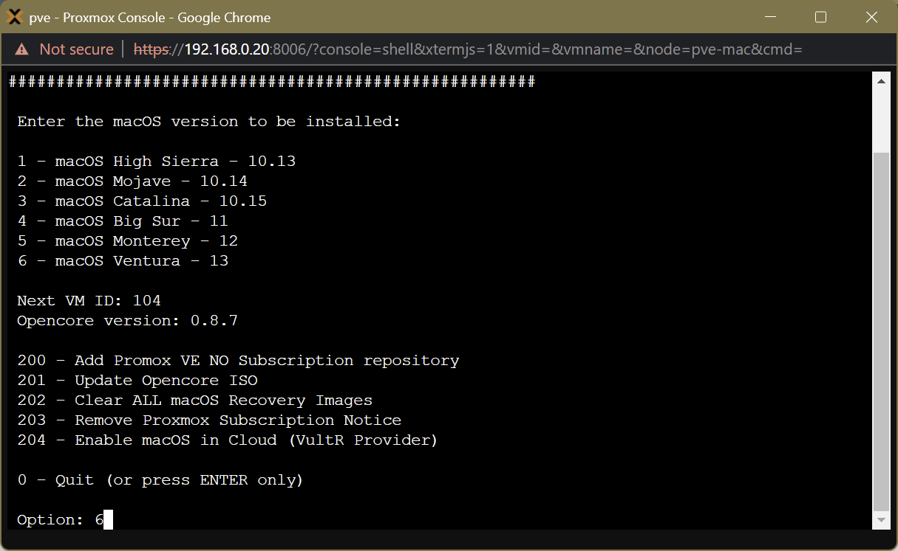
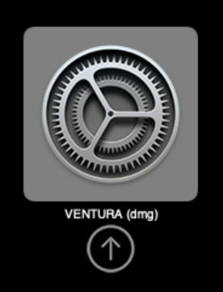
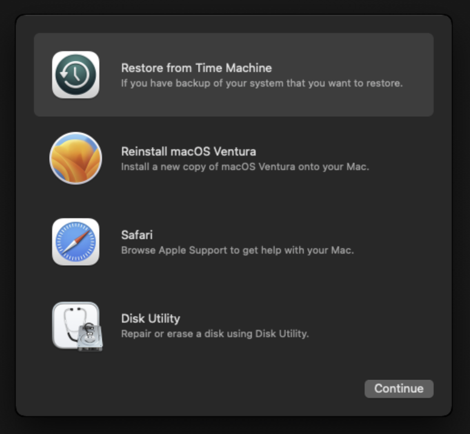
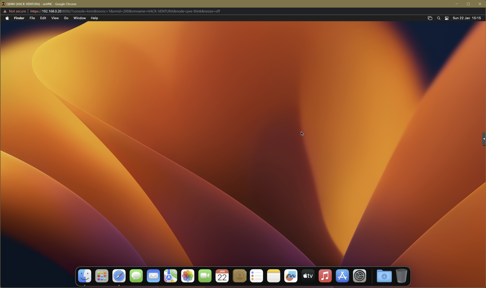
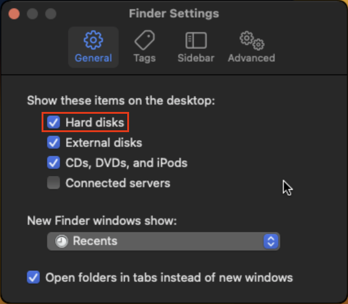
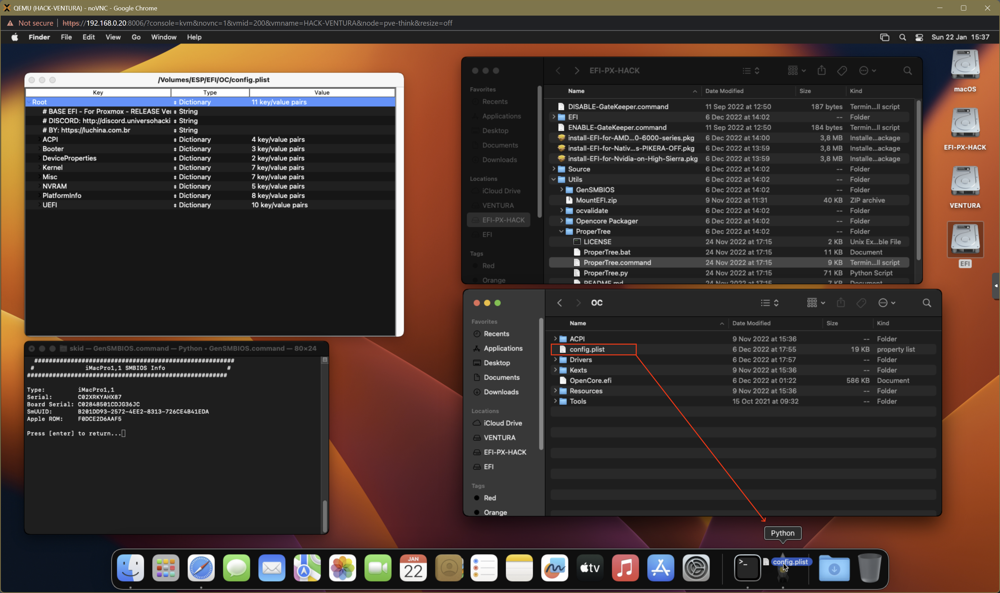
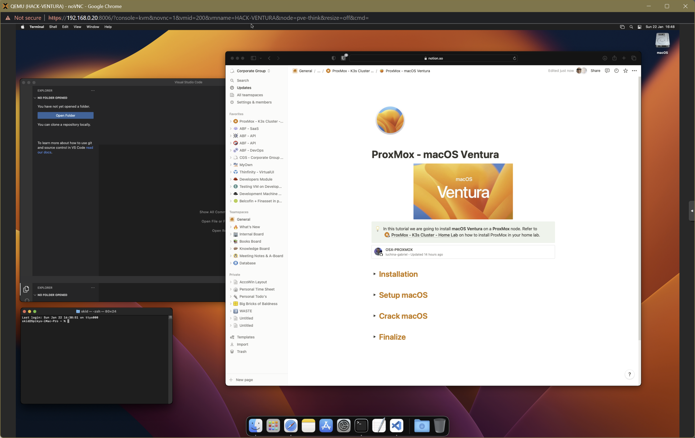

# 012. ProxMox ➡️ macOS



## Links

- [OSX ProxMox ISO](https://github.com/luchina-gabriel/OSX-PROXMOX)

## Installation

- **Navigate** to the **ProxMox web-interface** and open a **shell** on your machine of choice.

   
    
- **Paste** the following **command**.
    
    ```bash
    /bin/bash -c "$(curl -fsSL https://install.osx-proxmox.com)"
    ```
    
- After **rebooting** execute the following command
    
    ```bash
    osx-setup
    ```
    
- **Install** your **macOS** version of choice

    
    
    - **VM ID**: **`200`**
    - **VM Name**: **`macos-ventura`**
    - **Disk size**: **`64 Gb`**
    - **Storage**: **`local-lvm`**
    - **CPU**: **`4`**
    - **RAM**: **`4096MB`**
    - **Recovery**: **`Y`**

- **Navigate** to the **ProxMox web-interface** and **start** your **VM (***200***)**

    

## Setup

- Select **Disk Utility** from the menu

    
    
- **Erase** the **Apple Inc. VirtIO Block Media** disk

    - **Name**: **`macOS`**
    - **Format**: **`APFS`**
    - **Schema**: **`GUID Partition Map`**

- Select **Disk Utility → Quit Disk Utility** from the menu
- Select **Reinstall macOS Ventura** from the menu
- **Follow** the **Wizard** (*you may have to reboot multiple times, don’t create an AppleID, this will take a long, long time*)
    
    

## Crack

- Navigate to **Finder → Settings** → ✅ **Hard disks**
    
    
    
- Navigate to the disk **EFI-PX-HACK** on your desktop
- Install **Python** in **`/Utils` (***Continue x3, Agree, Install, Password, Install Software, Close)*
- Open up a **Terminal** and execute the following command
    
    ```bash
    sudo spctl --master-disable
    ```
    
- Double-click **install-EFI-for-AMD-5000-6000-series.pkg** on the **EFI-PX_HACK** disk (*Allow, Continue, Install, Password, Install Software, Close*)
- Double-click **`/Utils/GenSMBIOS/GenSMBIOS.command`**
    - 3: Generate SMBIOS
    - iMacPro1,1
- Double-click **`/Utils/ProperTree/ProperTree.command` (***No***)**
- **Drag** the file **`EFI/EFI/OC/config.plist`** onto the **Python Icon** in your task bar

    
    
- **Copy** the **Serial** value into the key `**Root/PlatformInfo/Generic/SystemSerialNumber**`
- **Copy** the **Board Serial** value into the key **`Root/PlatformInfo/Generic/MLB`**
- **Copy** the **SmUUID** value into the key **`Root/PlatformInfo/Generic/SystemUUID`**
- **Copy** the **Apple ROM** value into the key **`Root/PlatformInfo/Generic/ROM`**
- **File → Save (*Cmd + S*)**
- 🍏 Shutdown

## Finish

- **Stop** the **VM**
- Navigate to **Hardware** and **Detach** Hard Disk (*ide0*) and Hard Disk (*ide2*)
- **Start** the VM
- You can now **Create** a new **AppleID** if you want.
- **Install VSCode** on macOS: https://code.visualstudio.com/docs/setup/mac

    
