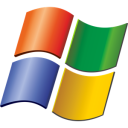
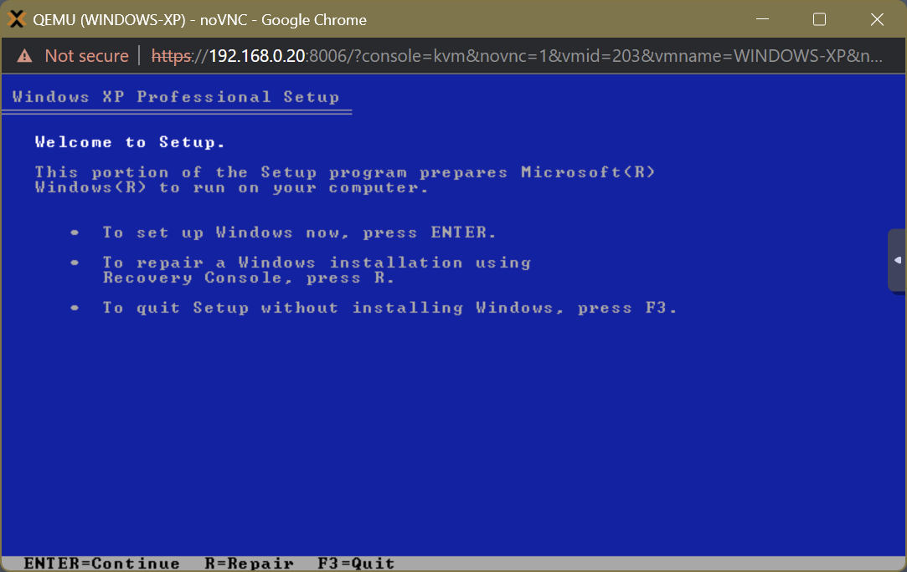
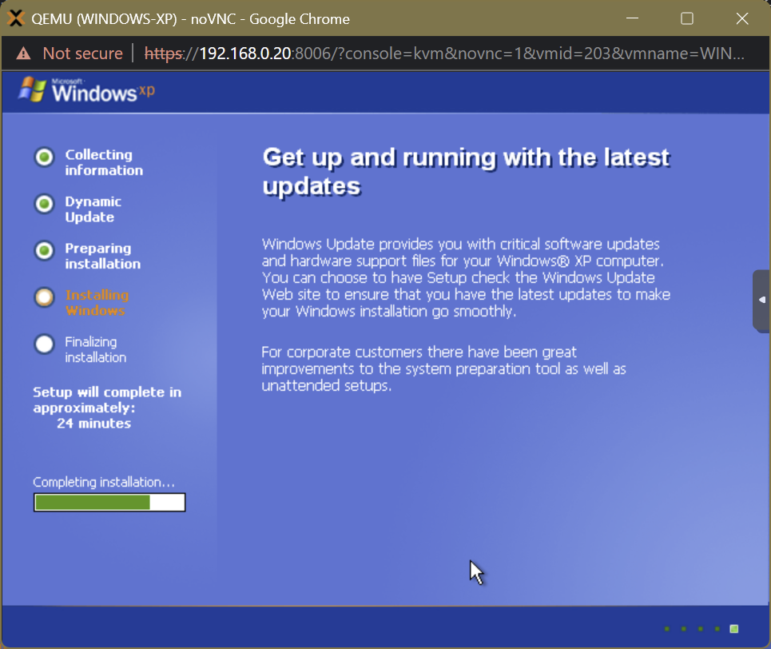
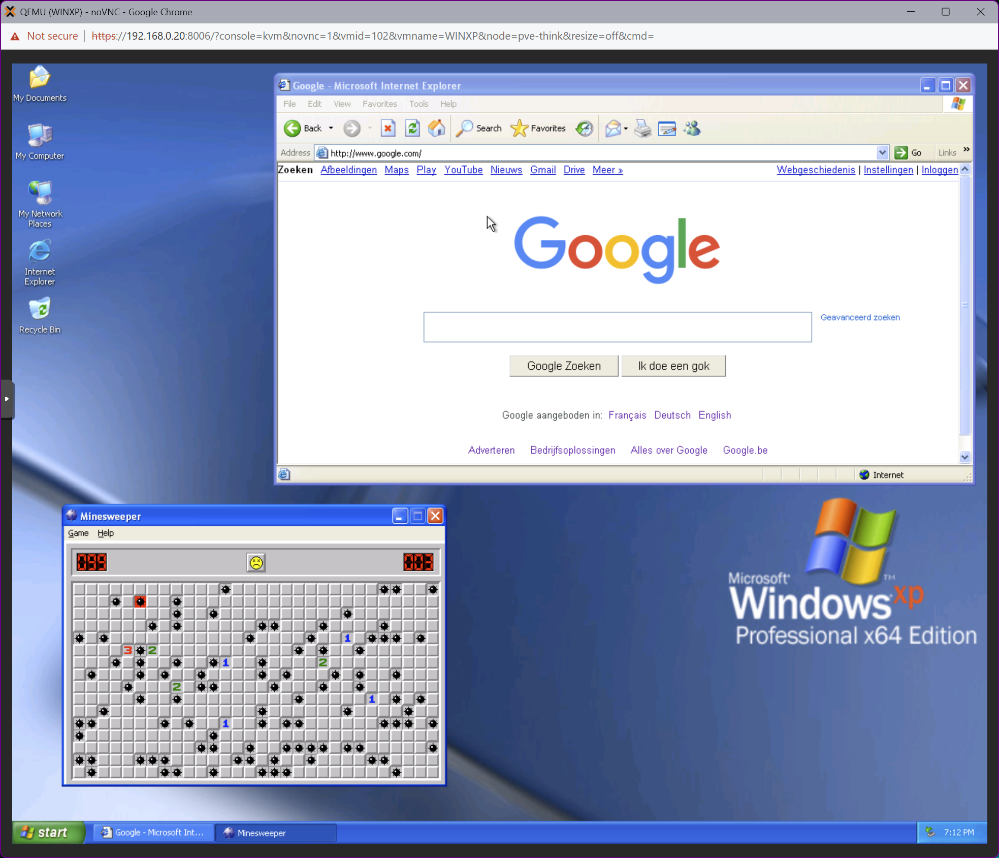

# 013. ProxMox ➡️ Windows XP

<!-- ## Video

In this Tutorial we are going to install Windows XP as a ProxMox Virtual Machine.
This will be a quick video just to get things setup...

 -->

## Links

- [Windows XP ISO](https://isoriver.com/windows-xp-iso-download)

## Installation

- **Upload** the ISO directly to the Proxmox machine by choosing **Download from URL**
- **Download Windows XP OS** from [here](https://archive.org/download/WindowsXPProfessional64BitCorporateEdition/Windows%20XP%20Professional%2064-bit%20Corporate%20Edition%28CD%20Key%20VCFQD-V9FX9-46WVH-K3CD4-4J3JM%29.iso)
- **Create** a new **VM** 
  - Select ISO-file
  - Microsoft Windows as Guest OS
  - XP/2003 as Version
  - Qemu Agent
  - 32GB Disk Size
  - 1x2 CPU
  - 4096 RAM
- **Start** the VM
- Press **Enter** to install Windows now...
  
- **F8** = I agree
- **C** = Create Partition
- **Enter** = Create
- **Enter** = Install
- **Enter** = Format NTFS file system
- **Enter** to Reboot

## Setup

- Section **Text Input Language**, click **Details**
- Provide your **Name**
- Provide your **Product Key**
  - *VCFQD-V9FX9-46WVH-K3CD4-4J3JM*
- Provide your **Computer name**
- Provide your **Password**
- Select your **Timezone**
- Choose **Typical settings**
- Choose **Workgroup**
  

## Finish

- Correct **Screen Resolution**
- Desktop Icons
- Setup **Network**
  - Start
  - Control Panel
  - Network & Internet
  - Network Connections
  - Setup Home Network (*next, next*)
  - Connects through Gateway
  - WORKGROUP
  - Turn on file and printer sharing
  - Finish
- Restart Windows XP
- Set IP-addresses and DNS Servers

  
