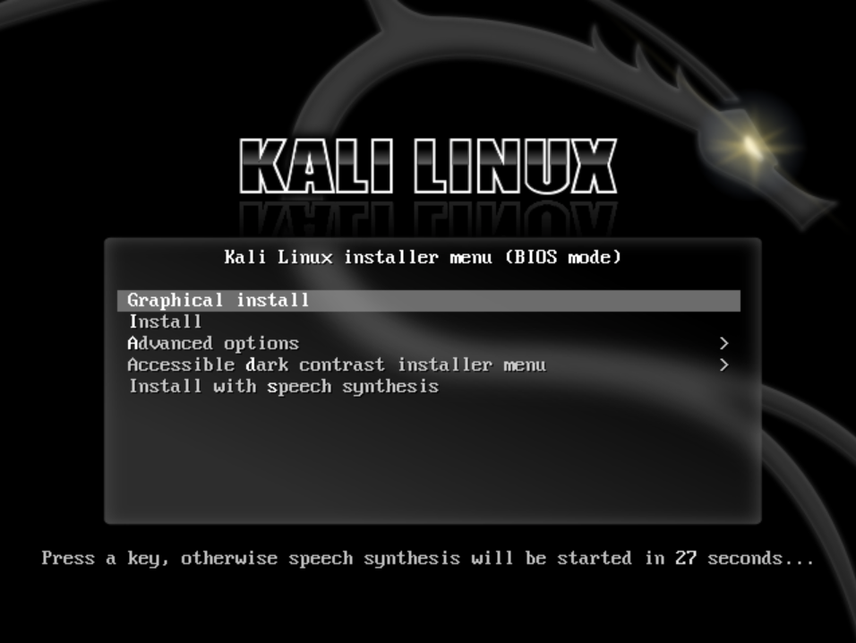
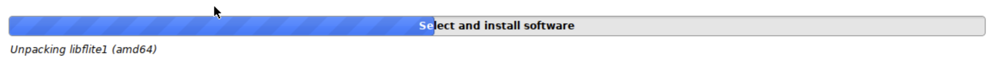

# 014. ProxMox ➡️ Kali Linux

## Video

In this Tutorial we are going to install Kali Linux as a ProxMox Virtual Machine.
This will be a quick video just to get things setup...

## Links

- [Kali Linux ISO](https://www.kali.org/get-kali)

## Installation

- **Download Kali Linux** from [here](https://cdimage.kali.org/kali-2023.2/kali-linux-2023.2a-installer-amd64.iso)
- **Upload** the ISO to the Proxmox machine.
- **Create** a new **VM** 
  - Select ISO-file
  - Qemu Agent
  - 64GB Disk Size
  - 2x2 CPU
  - 8192 RAM
- **Start** the VM

## Setup

- Select **Graphical Install**
  
- Select your **Language**
- Select your **Location**
- Select your **Locales**
- Select your **Keyboard**
- Provide a **Hostname**
- Provide a **Domain name**
- Provide a **Name**, a **Username** and a **Password**
- **Partition Disk**:
  - Guided - use entire disk
  - All files in one partition
  - Finish partitioning and write changes to disk
  - Choose **Yes** to erase all data
- Leave **Software selection** as default
  
- Install the **GRUB** bootloader on your main Hard Disk
- Click **Continue** to reboot

## Finish

- **Login** into your newly installed **Kali Linux**
  
- Setup your **Network** and **IP-address**. In this Tutorial we will use the following values:
  - Addresss: **192.168.0.32**
  - Netmask: 255.255.255.0
  - Gateway: 192.168.0.1
- **Reboot**