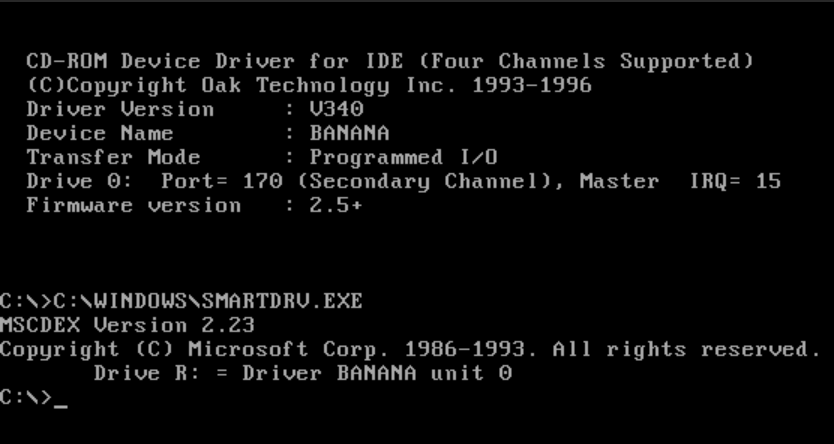
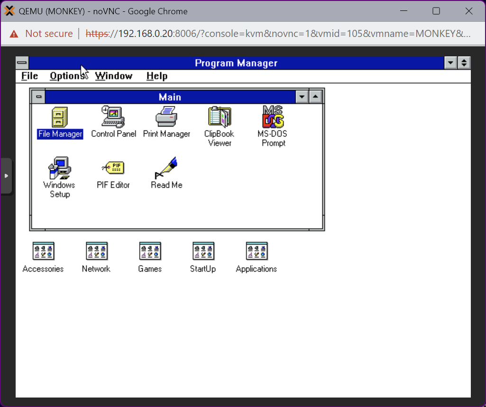
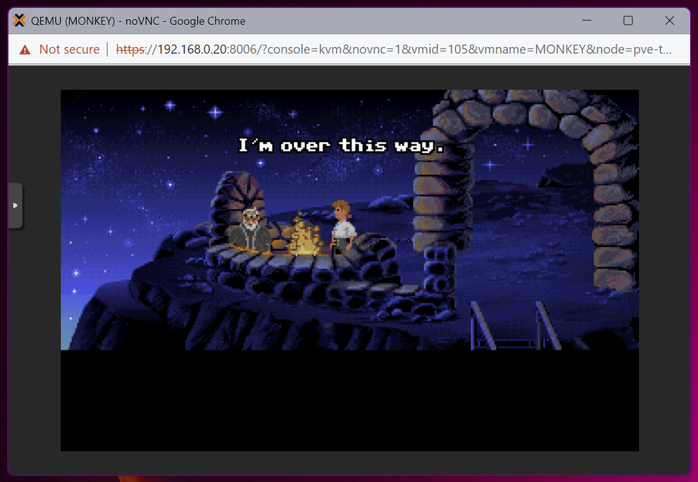

# 015. ProxMox ➡️ MSDOS 6.22

## Video

In this Tutorial we are going to install MSDOS 6.22 as a ProxMox Virtual Machine.
This will be a quick video just to get things setup...

[](https://youtu.be/lG5jVYrpKiM)

## Links

- [MSDOS ISO](https://www.allbootdisks.com/disk_images/DOS6.22_bootdisk.iso)
- [Windows 3.11 ISO](https://winworldpc.com/product/windows-3/wfw-311)
- [Background Music](https://freesound.org/people/Migfus20/sounds/560457/)

## Installation MSDOS

- **Upload** the MSDOS ISO directly to the Proxmox machine by choosing **Download from URL**
- **Download MSDOS** from [here](https://www.allbootdisks.com/disk_images/DOS6.22_bootdisk.iso)
- **Create** a new **VM**:
  - Select ISO-file
  - Microsoft Windows as Guest OS
  - 2000 as Version
  - Qemu Agent
  - 250MB Disk Size (0.25)
  - 1024 RAM
- **Start** the VM

- **Execute** **`fdisk`** and create a new primary partition
  - Create DOS partition or Logical DOS Drive (1)
  - Create Primary DOS Partition (1)
  - Maximum Size (Y)
  - ⚠️ Change the Boot Order in ProxMox before **Rebooting** (*Options ➡️ Boot Order*). Set the **ISO-file** (*CDROM*) first.
- **Stop** and **Restart** the machine

- **Execute** the following commands:
```
FORMAT C: /s

C:
MD MSDOS
COPY A:\*.* .\MSDOS /v
COPY A:\CONFIG.SYS
COPY A:\AUTOEXEC.BAT
COPY A:\HIMEM.SYS
COPY A:\CD1.SYS
```

- **Stop** the machine



## Installation Win 3.11

- **Download Windows 3.11** from [here](https://winworldpc.com/download/01c3ae0b-6c42-c38a-11c3-a7c29d255254) into the `./_assets/docker` folder
- **Run** the `_assets/docker/create-iso.sh` script:
  - This script will spin up a container that will **Unpack** the 7-Zip file into multiple **Image-files**.
  - Those Image-files will be further **Extracted** into **Raw files**.
  - The last command will create a **Bootable ISO-file** from the Raw files.
- **Upload** the ISO-file to the Proxmox machine.
- **Mount** this ISO-file to the CDROM-drive of your DOS machine.
- ⚠️ Change the Boot Order in ProxMox before **Rebooting** the machine (*Options ➡️ Boot Order*). Set the **C-Drive** (*MSDOS*) first.
- **Start** the machine
- **Execute** the following command:

```
R:\SETUP.EXE
```

## Setup Win 3.11

- To setup Windows now, press **Enter**
- **C** for **Custom Setup**
- **Enter** to **Continue**
- Set the **Keyboard Language**
- **Enter** to **Continue**

- Provide your **Name**
- Click **Continue**
- Click **Continue**
- Uncheck **Set Up Printers**
- Click **Continue**
- Click **Continue**

- Click **Continue**
- Click **Continue**
- Click **OK**

- Click **Search now**
- Click **OK**

- Click **Add All**
- Click **OK**

- Click **Skip Tutorial**
- Click **Restart Computer**

## Finish

- Run Windows 3.11 by executing `win` at the MSDOS-prompt




## Monkey Island

This part has its own video. 
For a hint on its location you need to watch the main video and think like a Q-Basic developer.

- **Download Monkey Island** from [here](https://archive.org/details/003048-TheSecretOfMonkeyIsland) into the `./_assets/docker` folder, as a 7z-file
- **Run** the `_assets/docker/create-iso.sh` script:
- **Rename** and **Upload** the ISO-file to the Proxmox machine.
- **Mount** this ISO-file to the CDROM-drive of your DOS machine.
- **Start** the machine
- **Execute** the following command:

```
R:\INSTALL.EXE
CD MONKEY
MONKEY
```



💡[COPY PROTECTION](https://www.oldgames.sk/codewheel/secret-of-monkey-island-dial-a-pirate)
