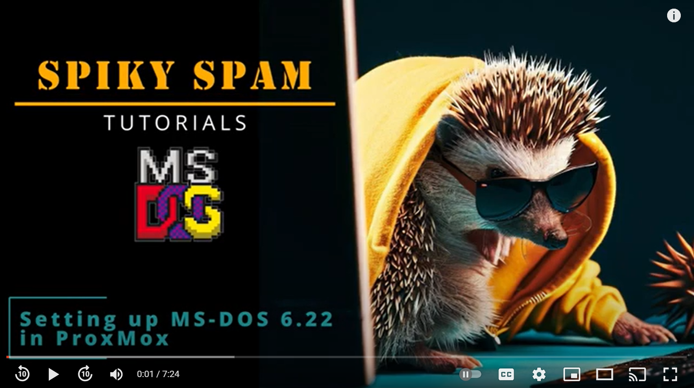

# 015. ProxMox ➡️ MSDOS 6.22

## Video

In this Tutorial we are going to install MS-DOS 6.22 as a ProxMox Virtual Machine.
This will be a quick video just to get things setup...

## Links

- [MSDOS ISO](https://www.allbootdisks.com/disk_images/DOS6.22_bootdisk.iso)
- [Background Music](https://freesound.org/people/Migfus20/sounds/560457/)

## Installation

- **Upload** the ISO directly to the Proxmox machine by choosing **Download from URL**
- **Download MS-DOS** from [here](https://www.allbootdisks.com/disk_images/DOS6.22_bootdisk.iso)
- **Create** a new **VM**:
  - Select ISO-file
  - Other Windows as Guest OS
  - Qemu Agent
  - 250MB Disk Size
  - 1024 RAM
- **Start** the VM

## Setup

## Finish
