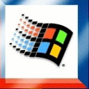
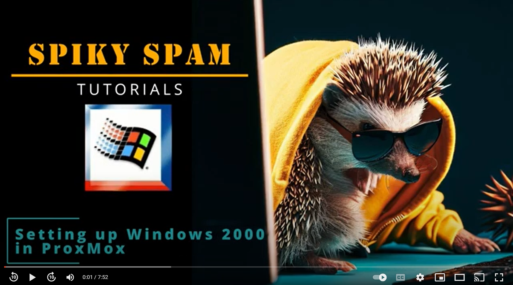
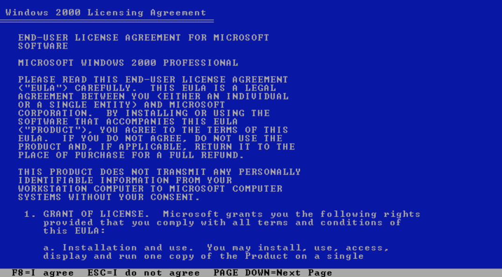
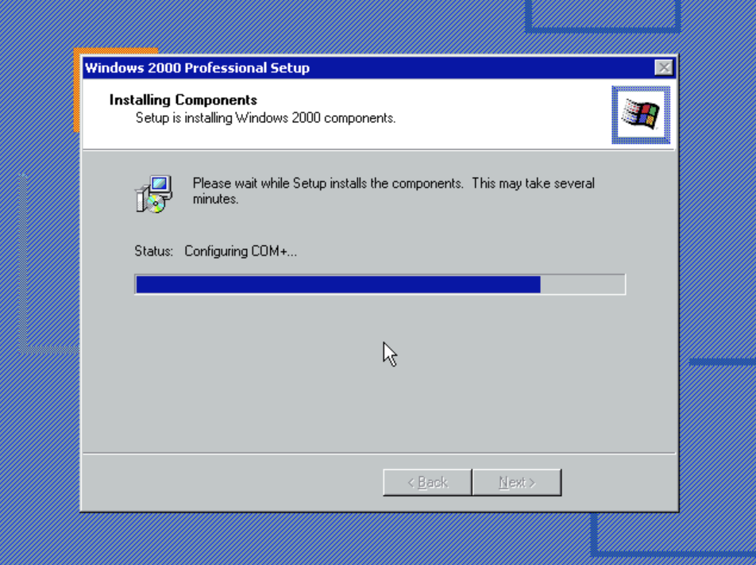
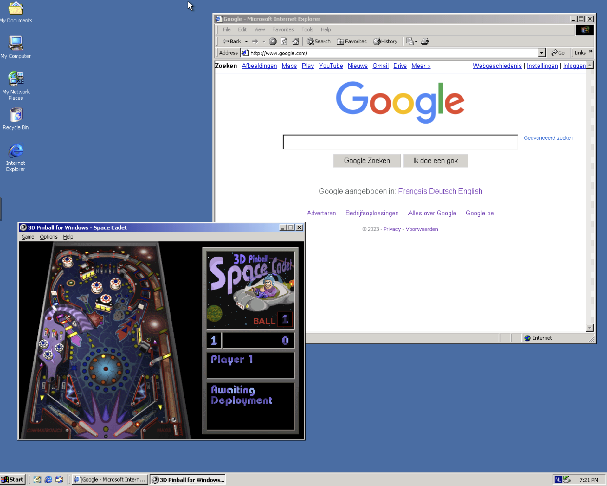

# 016. ProxMox ➡️ Windows 2000

## Video

In this Tutorial we are going to install Windows 2000 as a ProxMox Virtual Machine.
This will be a quick video just to get things setup...

## Links

- [Windows 2000 ISO](https://winworldpc.com/product/windows-nt-2000/final)
- [Background Music](https://freesound.org/people/Migfus20/sounds/683262/)

## Installation

- **Download Windows 2000** from [here](https://winworldpc.com/download/4137770d-e828-11e7-a562-fa163e9022f0/from/c3ae6ee2-8099-713d-3411-c3a6e280947e) into the `./_assets/docker` folder
- **Unpack** the **7z-file** by executing `_assets/docker/extract.sh`, or using the online tool [Extract ME](https://extract.me/), or anything else... 
- **Upload** the ISO to the Proxmox machine.
- **Create** a new **VM** 
  - Select ISO-file
  - Microsoft Windows as Guest OS
  - 2000 as Version
  - Qemu Agent
  - 64GB Disk Size
  - 1x2 CPU
  - 4096 RAM
- **Start** the VM
- Press **Enter** to install Windows now...
- **F8** = I agree
  
- **C** = Create Partition
- **Enter** = Create
- **Enter** = Install
- **Enter** = Format NTFS file system
- **Enter** to Reboot

## Setup

- Section **Keyboard Layout**, click **Customize**
- Provide your **Name**
- Provide your **Computer name**
- Provide your **Password**
- Select your **Timezone**
- Choose **Typical settings**
- Choose **Workgroup**
  
- Click **Finish** to Reboot
- Click **Next** to Start the Wizard
- Set the **Default User**
- Click **Finish**

## Finish

- Correct **Screen Resolution**
- Setup **Network**
  - Start ➡️ Settings ➡️ Control Panel
  - Network & Dial-up Connections
- Right-Click **Local Area Connection**
- Choose **Properties**
- Set IP-addresses and DNS Servers
- Open **Internet Explorer**
- Select **Connect through LAN**
  
