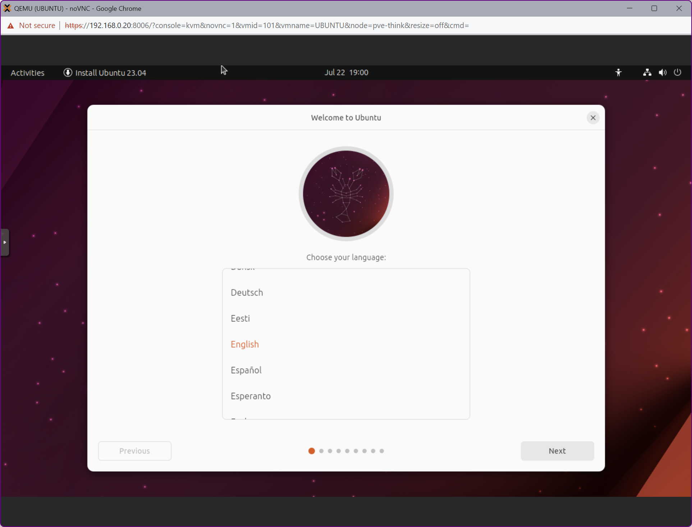
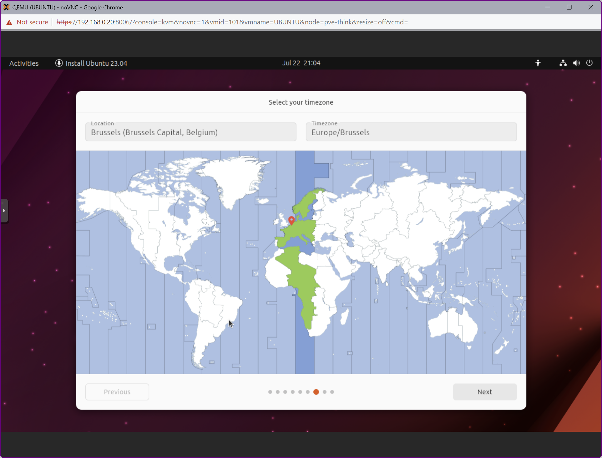
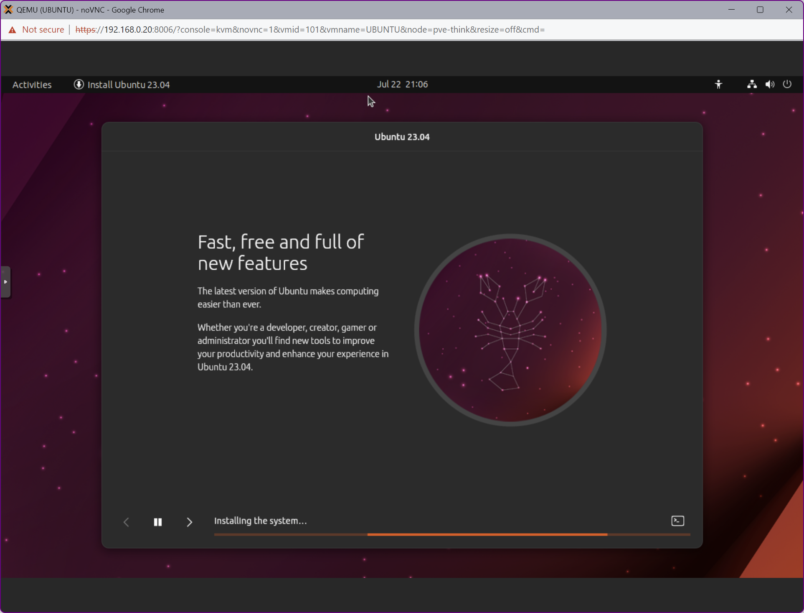
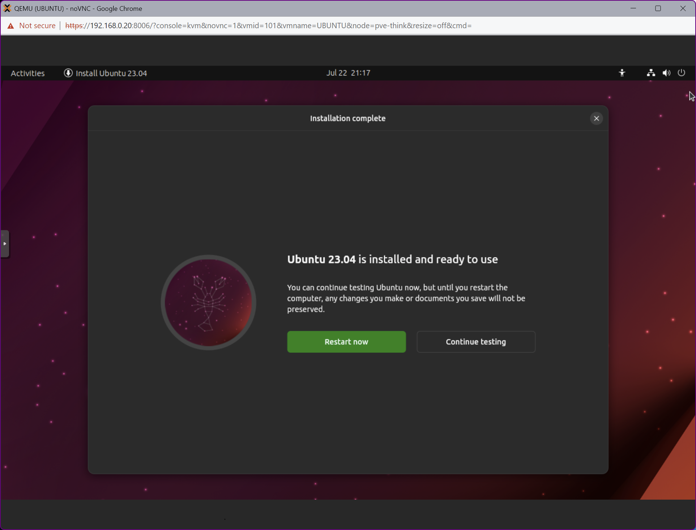

018. ProxMox➡️ Ubuntu

## Video

In this Tutorial we are going to install the Android OS as a ProxMox Virtual Machine.
This will be a quick video just to get things setup...

## Links

- [Ubuntu OS ISO](https://ubuntu.com/download/desktop)

## Installation

- **Upload** the ISO directly to the Proxmox machine by choosing **Download from URL**
- **Download Ubuntu OS** from [here](https://releases.ubuntu.com/lunar/ubuntu-23.04-desktop-amd64.iso)
- **Create** a new **VM**:
  - Select ISO-file
  - Qemu Agent
  - 64GB Disk Size
  - 2x2 CPU
  - 8192 RAM
- **Start** the VM
- Select **Try or Install Ubuntu**
   

## Setup

- Select your **Language**
- Check **Install Ubuntu**
- Select your **Keyboard Layout**
- Select your **Network**
- Select **Minimal Installation**
- Select **Erase disk and install Ubuntu**
- Click **Install**
- Select your **Timezone**
  
- Provide your **User** and **Password**
- Select your **Theme**
  
- Click **Restart now**
- Edit your VM's **Hardware**, select **do not use any media** on your CD-drive
- Press **ENTER** to **Reboot**
  

## Finish

- Login into your machine
- Setup your **Network** and **IP-address**. In this Tutorial we will use the following values:
  - Addresss: **192.168.0.30**
  - Netmask: 255.255.255.0
  - Gateway: 192.168.0.1
- Install **Updates**
