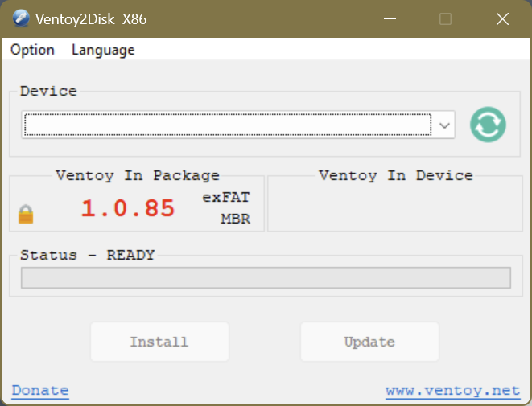
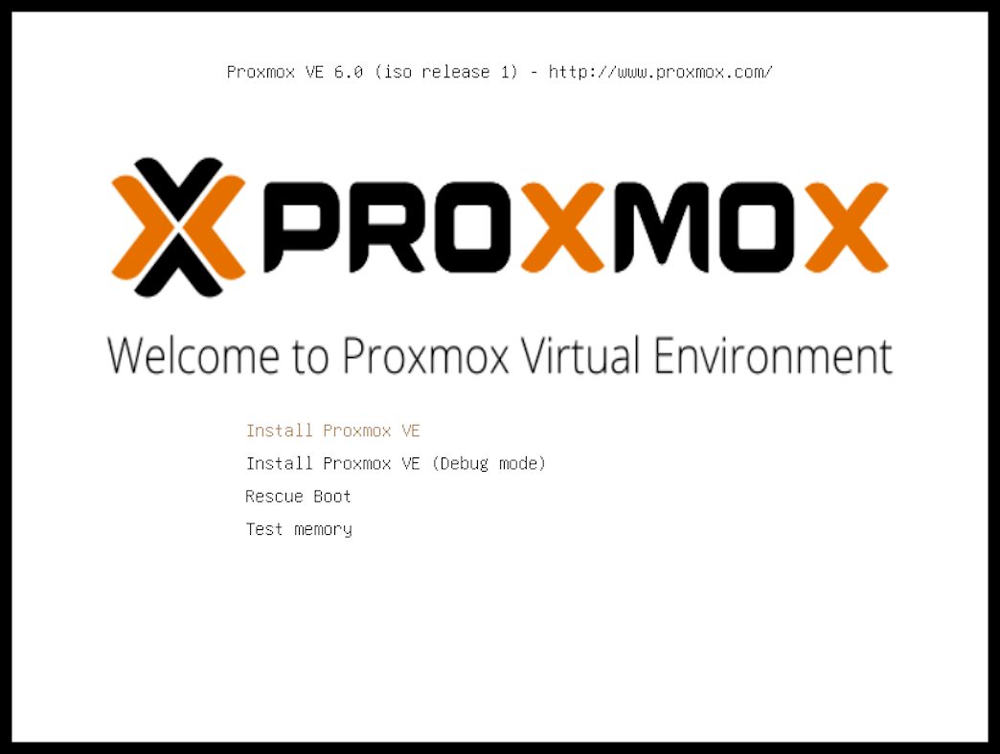
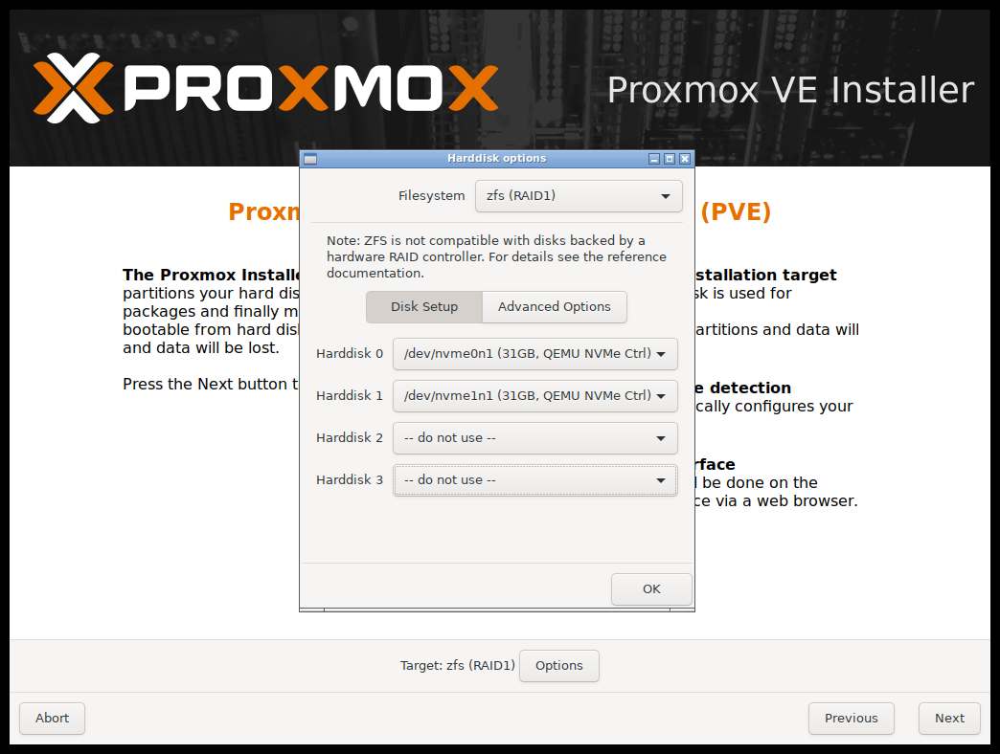
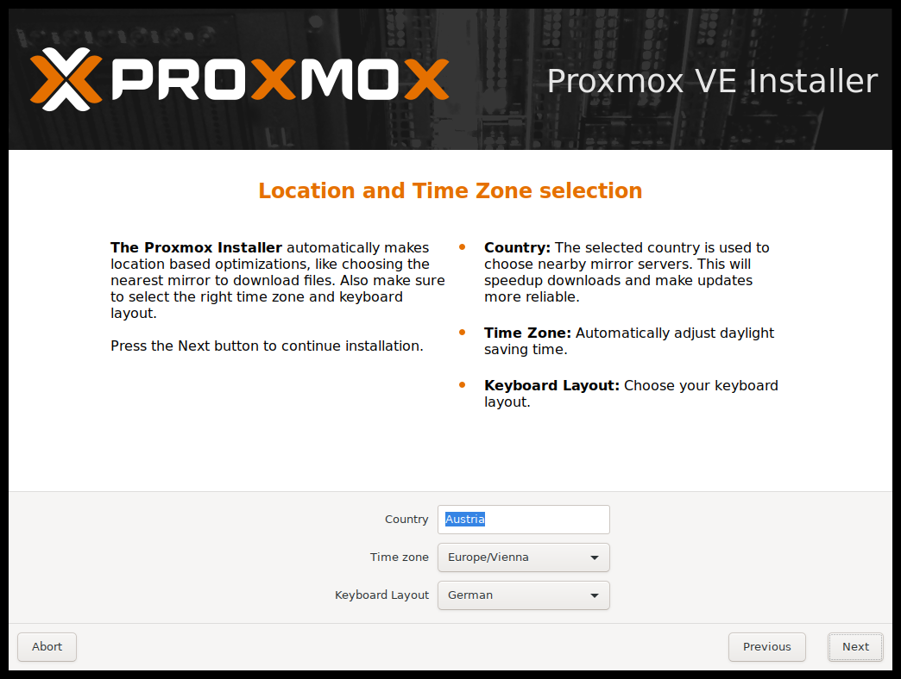
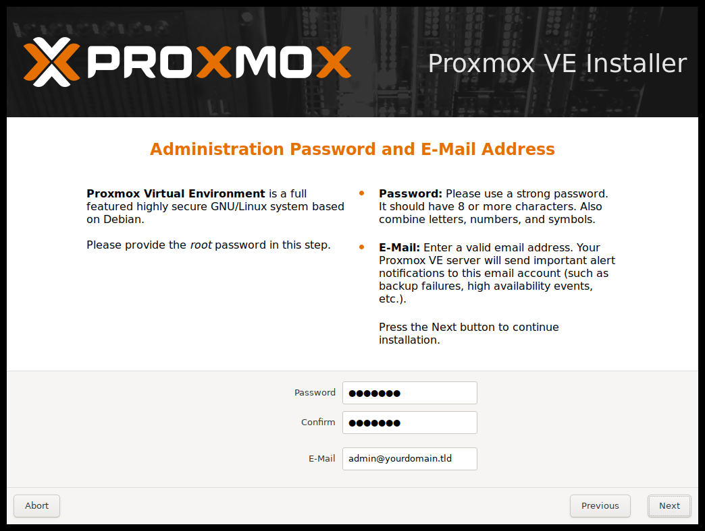
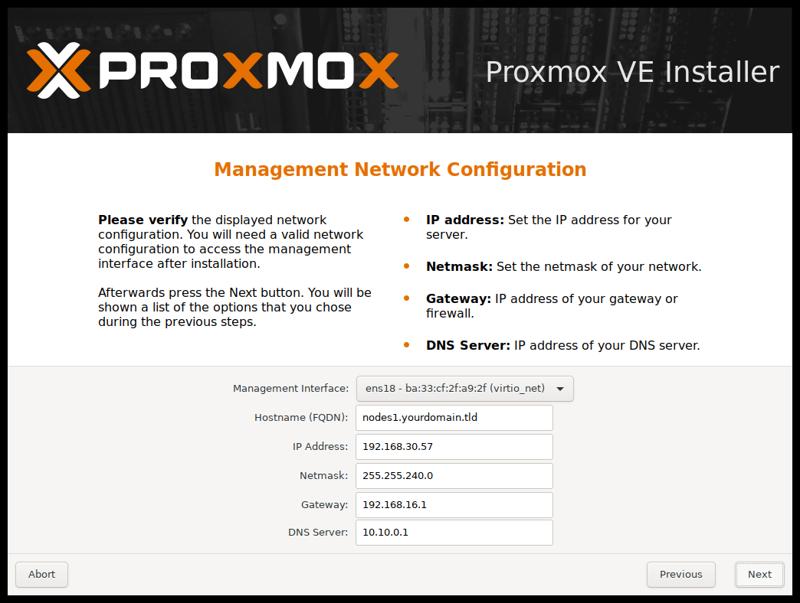
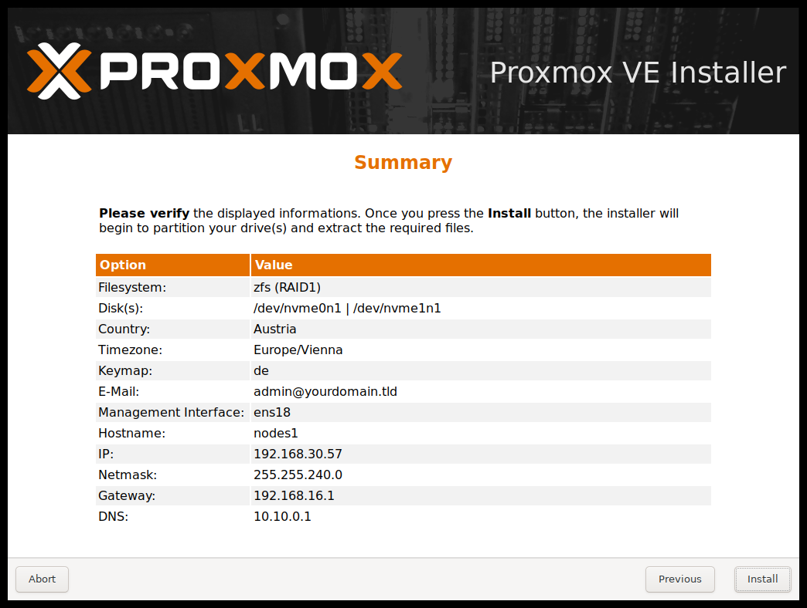
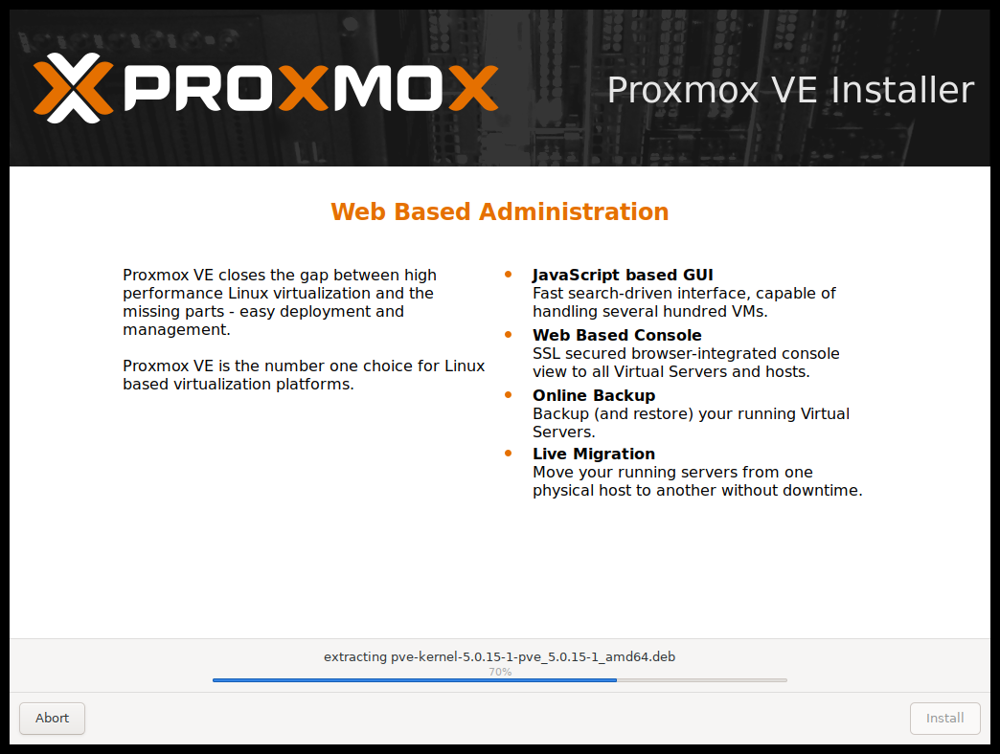

# 01. Setting up a Cheap Home Lab with ProxMox

## Links

- [Installing ProxMox VE](https://pve.proxmox.com/pve-docs/chapter-pve-installation.html)
- [Download Ventoy](https://www.ventoy.net/en/download.html)

## Preparation

- Enable **Virtualization** and **Secure Boot** in your BIOS settings:
   
- Download and **Unpack** the Ventoy ZIP-file and execute **Ventoy2Disk.exe**
- Insert your USB-Stick and click Install.
   
- **Download** the latest **Proxmox VE x.x ISO Installer** ISO-file from [here](https://www.proxmox.com/en/downloads/category/iso-images-pve)
- **Copy** the **ISO-file** to your USB-Stick

## Instalation

- **Plug it in** your old laptop and **reboot** into it. Follow the Wizard:
   - Install Proxmox VE
      
   - Configure your Hard Disk
      
   - Select Country, TimeZone & Keyboard
      
   - Choose Password (for root)
      
   - Setup Hostname and IP-address (192.168.0.20 for this tutorial)
      
   - Install
      
      
   - Reboot your laptop
   - You can now **navigate** to the ProxMox **web-interface** from another PC (above ip, ex. https://192.168.0.20:8006).

  ## Virtual Machines

  - [Android OS](011_android_os/README.md)
  - [macOS](012_mac_os/README.md)