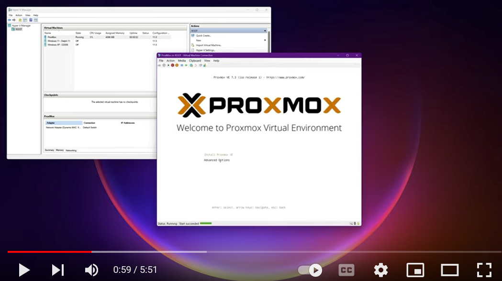

# 01. Setting up a Cheap Home Lab with ProxMox

In this Tutorial we are going to setup our home lab with 3 old PC's, with ProxMox installed on every machine:

- A HP Desktop
- A Thinkpad
- A macBook

## Video

In this video we demonstrate how to install ProxMox on a Virtual Machine. The installation steps should be the same on a physical machine:

## Links

- [Installing ProxMox VE](https://pve.proxmox.com/pve-docs/chapter-pve-installation.html)
- [Download Ventoy](https://www.ventoy.net/en/download.html)

## Virtual Machines

A list of other Tutorials when installing one of these Operating System onto ProxMox (***also see below***):

- [Android OS](011_android_os/README.md)
- [macOS](012_mac_os/README.md)
- [Windows XP](013_windows_xp/README.md)
- [Kali Linux](014_kali_linux/README.md)
- [MS-DOS 6.22](015_msdos/README.md)
- [Windows 2000](016_win2000/README.md)
- [Qubes OS](017_qubes_os/README.md)
- [Ubuntu](018_ubuntu/README.md)

## Preparation

- Enable **Virtualization** and **Secure Boot** in your BIOS settings. This will be a little different on every machine:

   

- [Download](https://www.ventoy.net/en/download.html) and **Unpack** the Ventoy ZIP-file and execute **Ventoy2Disk.exe**

- Insert your USB-Stick and click Install.

   

- **Download** the latest **Proxmox VE x.x ISO Installer** ISO-file from [here](https://www.proxmox.com/en/downloads/category/iso-images-pve)

- **Copy** the **ISO-file** to your USB-Stick

## Instalation

- **Plug it in** your old machines and **reboot** into it. Follow the Wizard:

   - Install Proxmox VE

      

   - Configure your Hard Disk

      

   - Select Country, TimeZone & Keyboard

      

   - Choose Password (for root)

      

   - Setup Hostname and IP-address (see the Network section below for this tutorial)

      

   - Install

      
      

   - Reboot your laptop

   - You can now **navigate** to the ProxMox **web-interface** on port 8006 from another PC (ex. https://192.168.0.20:8006).

## Network

In this tutorial we have setup 3 machines with ProxMox, using the following IP-addresses:

- Thinkpad: 192.168.0.20
- HP Desktop: 192.168.0.40
- MacBook: 192.168.0.60

## Virtual Machines

- [Android OS](011_android_os/README.md)
- [macOS](012_mac_os/README.md)
- [Windows XP](013_windows_xp/README.md)
- [Kali Linux](014_kali_linux/README.md)
- [MS-DOS 6.22](015_msdos/README.md)
- [Windows 2000](016_win2000/README.md)
- [Qubes OS](017_qubes_os/README.md)
- [Ubuntu](018_ubuntu/README.md)