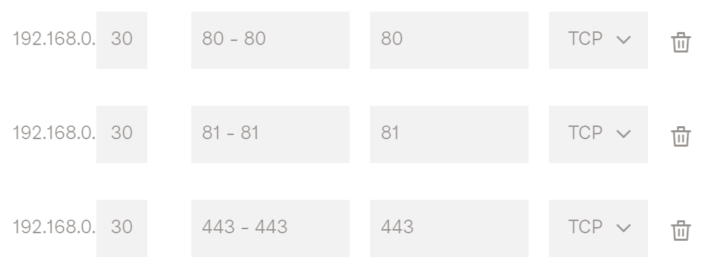

# 03. Nginx Proxy Manager


In this Tutorial we are going to setup **Nginx Proxy Manager**, so we can redirect public incomming request to a correct machine and/or application in our homelab.

## Video

In this video I demonstrate how to install the Nginx Proxy Manager on a fresh Ubuntu Virtual Machine (in ProxMox).

[](https://youtu.be/XXXXXXXXXXXXXXXXXXXXXXX)

## Links

- [Nginx Proxy Manager Site](https://nginxproxymanager.com)
- [Nginx Proxy Manager Github](https://github.com/NginxProxyManager/nginx-proxy-manager)

## Prerequisites

- [02. Setting up our Project Structure](../02_setting_up_our_project_structure/README.md)

## Install NGinx Proxy Manager

- Create the following **docker-compose** file.

  ```bash
  mkdir $TF_VAR_PATH_APP/docker/npm
  nano $TF_VAR_PATH_APP/docker/npm/docker-compose.yaml
  ```

  ```yaml
  version: '3.8'

  services:
    npm: 
      container_name: npm
      image: jc21/nginx-proxy-manager:${TF_VAR_VERSION_DOCKER_NPM}
      restart: unless-stopped
      environment:
        PUID: 1000
        PGID: 1000
      ports:
        - "80:80"
        - "81:81"
        - "443:443"
      volumes:
        - $HOME/docker/npm/data:/data
        - $HOME/docker/npm/letsencrypt:/etc/letsencrypt
  ```

- Deploy it using following command
  ```bash
  docker compose -f $TF_VAR_PATH_APP/docker/npm/docker-compose.yaml up -d
  ```

- **Login** to the Admin UI at http://localhost:81
    - Email: `admin@example.com`
    - Password: `changeme`
- **Change** your **username** and **password** (for values, see prerequisites):
  - Username: **`$TF_VAR_NPM_USER`**
  - Password: **`$TF_VAR_NPM_PASSWORD`**

- Open port 81 on your firewall
  ```bash
  sudo ufw allow 81/tcp
  ```

## Add A-Record at your DNS

- Navigate to the [Networking](https://cloud.digitalocean.com/networking) section of Digital Ocean (*or your DNS provider of choice, like CloudFlare, …*)
- Click Domains and add an A-record that points to your public WAN IP.


## Forward port 80, 81 and 443 at your ISP

- Telenet
  - Login into **mijn-telenet** and navigate to your home network settings:
https://mijn.telenet.be/mijntelenet/homenetwork/
  - Add the following port-forward rule (*change your local ip-address accordingly*)


