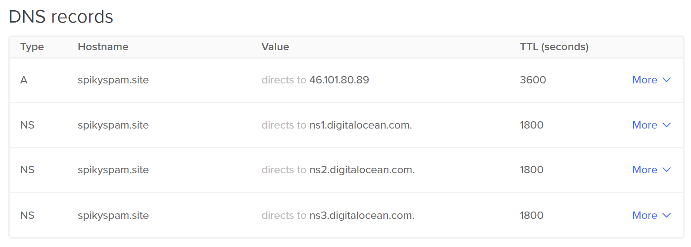

# 03. Nginx Proxy Manager


In this Tutorial we are going to setup **Nginx Proxy Manager**, so we can redirect public incoming request to a correct machine and/or application in our homelab without compromising our public IP address at home.

## Video

In this video I demonstrate how to install the **Nginx Proxy Manager** on a **Digital Ocean** Droplet.

[](https://youtu.be/CsO7Y5NKnYo)

## Links

- [Nginx Proxy Manager Site](https://nginxproxymanager.com)
- [Nginx Proxy Manager Github](https://github.com/NginxProxyManager/nginx-proxy-manager)
- [Background Music](https://freesound.org/people/Seth_Makes_Sounds/sounds/670039/)

## Prerequisites

- A registered **Hostname** (***spikyspam.site***). I've used **[HostGator](https://www.hostgator.com)**.
- A **DNS Provider**. I've used **[Digital Ocean](https://digitalocean.com)** in this tutorial.
- **Logged in** into the **Digital Ocean** Dashboard

## Create Digital Ocean SSH-key

- Open a **Terminal** and execute following commands to create a **private/public key-pair**:
  ```bash
  ssh-keygen -f $HOME/.ssh/do
  ```

- Open the **Digital Ocean** website and navigate to **Settings** ➡️ **Security** 
- Click **Add SSH Key**.
- **Paste** in the content of your public key: 
  ```bash
  cat $HOME/.ssh/do.pub
  ```

- Give it a name (**do**) and click **Add SSH Key**

## Create Digital Ocean Droplet (*4$/month*)

- Navigate to **Droplets**
- Click **Create Droplet**
  - **Region**: *(near you)*
  - **Image**: Ubuntu 22.04 (LTS) x64
  - **Type**: Basic
  - **CPU**: Regular
  - **Price**: 4$/mo
  - **Authentication Method**: SSH
  - **Hostname**: npm
- Remember the **IP address** of your droplet. For this tutorial it will be **46.101.80.89**


## Setup Droplet

- **SSH** into your Droplet as **root**
  ```bash
  ssh root@46.101.80.89 -i $HOME/.ssh/do
  ```

- **Execute** following commands:
  ```bash
  sudo apt update && sudo apt upgrade -y
  reboot
  ```

- **SSH** into your Droplet as **root**
  ```bash
  ssh root@46.101.80.89 -i $HOME/.ssh/do
  ```

- **Execute** following commands:
  ```bash
  adduser spiky-spam
  usermod -aG sudo spiky-spam
  cp -r ~/.ssh /home/spiky-spam
  chown -R spiky-spam:spiky-spam /home/spiky-spam/
  exit
  ```

## Install Docker

- **SSH** into your Droplet as **spiky-spam**
  ```bash
  ssh spiky-spam@46.101.80.89 -i $HOME/.ssh/do
  ```
  See the **Install Docker** section in [02. Setting up our Project Structure](../02_setting_up_our_project_structure/README.md#install-docker) 

## Install NGinx Proxy Manager

- **SSH** into your Droplet as **spiky-spam**
  ```bash
  ssh spiky-spam@46.101.80.89 -i $HOME/.ssh/do
  ```

- Create the following **docker-compose** file.

  ```bash
  nano docker-compose.yaml
  ```

  ```yaml
  version: '3.8'

  services:
    npm: 
      container_name: npm
      image: jc21/nginx-proxy-manager:latest
      restart: unless-stopped
      environment:
        PUID: 1000
        PGID: 1000
      ports:
        - "80:80"
        - "81:81"
        - "443:443"
      volumes:
        - $HOME/docker/npm/data:/data
        - $HOME/docker/npm/letsencrypt:/etc/letsencrypt
  ```

- Deploy it using following command
  ```bash
  docker compose up
  ```

## Add A-Record 

- Navigate to the [Networking](https://cloud.digitalocean.com/networking) section of **Digital Ocean**.
- Click the tab **Domains** and add an A-record to your domain (*spikyspam.site*) that points to your NPM Droplets IP address.
- Before you can use this domain name, it needs to **propagate** through the internet. You can check the status [here](https://dnschecker.org/).



## Configure NGinx Proxy Manager

- **Login** to the Admin UI at http://spikyspam.site:81
    - Email: `admin@example.com`
    - Password: `changeme`
- **Change** your **username** and **password** to the secrets stored in your  [.bash_profile](../SS/.bash_profile_public) file.
  - Email: **`$TF_VAR_NPM_USER`**
  - Password: **`$TF_VAR_NPM_PASSWORD`**
    ```bash
    echo $TF_VAR_NPM_USER
    echo $TF_VAR_NPM_PASSWORD
    ```

## Add Proxy Hosts

- **Domain Names**: 
  - npm.spikyspam.site
- **Scheme**: http
- **Forward IP**: 46.101.80.89 (*💡 IP address of the NPM Droplet*)
- **Port**: 81
- Block Common Exploits
- Websockets Support
- **SSL**:
  - Let's Encrypt
  - Force SSL
- **Login** to the Admin UI at **https://npm.spikyspam.site**
