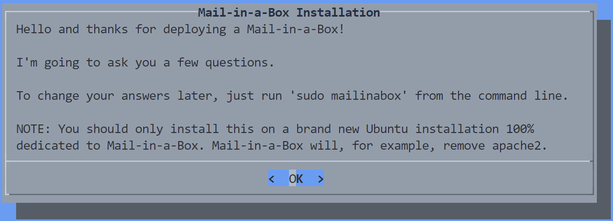
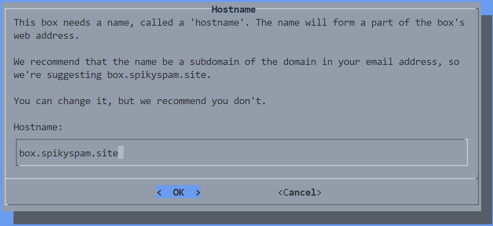

# 04. Mail-in-a-Box


In this Tutorial we are going to setup **Mail-in-a-Box** to have our own **Mail Server**:

## Video

In this video we demonstrate how to install **Mail-in-a-Box** on a fresh Ubuntu Server Virtual Machine (in ProxMox).

[](https://youtu.be/XXXXXXXXXXXXXXXXXXXXXXX)

## Links

- [Ubuntu Server ISO](https://ubuntu.com/download/server)
- [Mail-In-a-Box Site](https://mailinabox.email/)
- [Mail-In-a-Box Github](https://github.com/mail-in-a-box/mailinabox)

## Prerequisites

- [03. Nginx Proxy Manager](../03_nginx_proxy_manager/README.md)

## Create Ubuntu Server VM

1️⃣
- **Login** into your **ProxMox** dashboard
- **Upload** the ISO directly to the Proxmox machine by choosing **Download from URL**
- **Download Ubuntu Server OS** from [here](https://releases.ubuntu.com/22.04.3/ubuntu-22.04.3-live-server-amd64.iso)

2️⃣
- **Create** a new **VM**:
  - Select ISO-file
  - Qemu Agent
  - Graphic card: SPICE
  - 32GB Disk Size
  - 1x1 CPU
  - 2048 RAM
- **Start** the VM

3️⃣
- Follow the **Wizard** (*with default values, except:*).
  - Set your IP address to **192.168.0.31** (*for this tutorial*)
    - **Subnet**: 192.168.0.0/24
    - **Address**: 192.168.0.31
    - **Gateway**: 192.168.0.1
    - **Name servers**: 1.1.1.1,8.8.8.8
  - Set **Username** and **Password**
  - Install the **OpenSSH** server
- Press **Reboot Now** after installation

4️⃣
- **Login** into your VM and **Execute** the following commands:
    ```bash
    sudo apt update && sudo apt upgrade -y

    # add your user to the sudo group
    sudo usermod -aG sudo spiky-spam

    # configure your keyboard (if not set in the installation wizard)
    # sudo dpkg-reconfigure keyboard-configuration
    ```
- **Execute** the following commands to check if your domain has been setup correctly in the file **`/etc/hosname`** for this VM:
    ```bash
    sudo nano /etc/hostname
    ```
- **Change** into your **box domain without ns1/2-prefix**:
    ```
    box.spikyspam.site
    ```
- **Exit** (*Ctrl+X*) and **Save** (*Y*) your changes.
- Also edit **/etc/hosts:**
    ```bash
    127.0.1.1 box.spikyspam.site
    ```
- **Reboot** your VM with the following command:
    
    ```bash
    reboot
    ```

## Add Name Server Records

- Get your WAN IP address by navigating to [What is my IPAddress](https://whatismyipaddress.com/)
- Navigate to [Digital Ocean](https://www.digitalocean.com/) (*or any other provider for your domain records*)
- Navigate to **Networking** in the Digital Ocean menu
- Click the tab **Domains**
- Choose your base domain
- Click **NS**
- Create 2 NS-records:
    - NS1
        - **Hostname**: **ns1**.box.spikyspam.site
        - **Will Direct To**: ✂️ *your WAN IP-address*
        - Click **Create Record**
    - NS2
        - **Hostname**: **ns2**.box.spikyspam.site
        - **Will Direct To**: ✂️ *your WAN IP-address*
        - Click **Create Record**
- Create A-record
  - **Hostname**: box
  - **Will Direct To**: ✂️ *paste in your WAN IP-address*
  - Click **Create Record**
- Create AAAA-record
  - **Hostname**: box
  - **Will Direct To**: ✂️ *paste in your WAN IPv6-address*
  - Click **Create Record**

## Setup NPM Proxy Hosts

- **box.spikyspam.site** -> https://192.168.0.31:443 (*with Let's Encrypt*)     

## Forward port 25, 465, 587, 993 and 4190 at your ISP

Because Telenet blocks port 25 for non-business users, I'm unable to send e-mails at the moment. You should be fine when your ISP doens't block port 25.

- Telenet
  - Login into **mijn-telenet** and navigate to your home network settings:
https://mijn.telenet.be/mijntelenet/homenetwork/
  - Add the following port-forward rule (*change your local ip-address accordingly*)


## Install Mail-in-a-Box

- **Execute** the following command to start the installation of Mail-in-a-Box (*check their website for the up-to-date command*):
    
    ```bash
    curl -s https://mailinabox.email/setup.sh | sudo -E bash
    ```
    
- Hit **Enter**
    
    
    
- Specify your admin e-mail address → **admin@spikyspam.site**:
    
    

- Specify your domain → **box.spikyspam.site**:
    
    
    
- Choose your **Area**:
    
    
    
- Click **OK**
- Provide a **Password** for admin@spikyspam.site
    
    
    

## Login into Admin Panel

- **Navigate** to https://box.spikyspam.site/admin
- **Provide** your Admin e-mail address and **password**
- Navigate to **System → TLS (SSL) Certificates** and click the **Provision** button
- Navigate to **System → Status Checks** and click **Enable New-Version Check**

## Login into E-mail Client

- **Navigate** to https://box.spikyspam.site/mail
- **Provide** your Admin e-mail address and **password**
- Click **Login**
    
