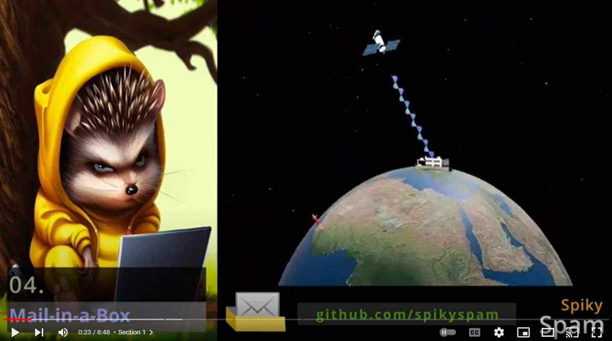
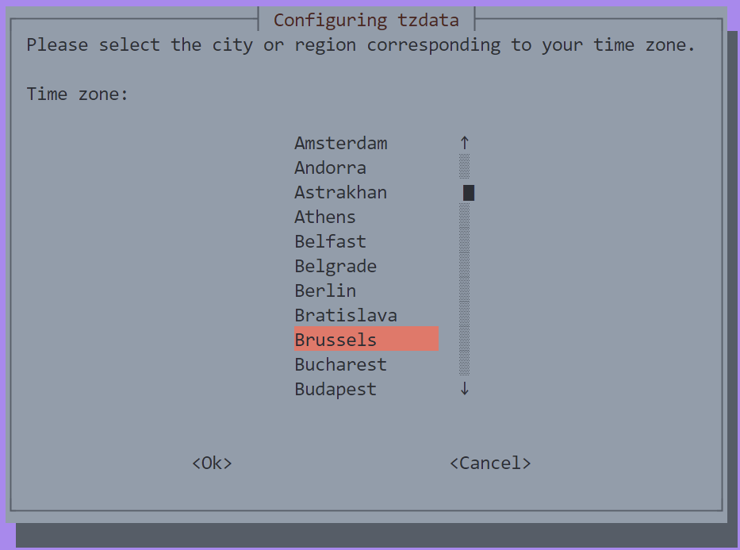

# 04. Mail-in-a-Box


In this Tutorial we are going to setup **Mail-in-a-Box** to have our own **Mail Server**:

## Video

In this video we demonstrate how to install **Mail-in-a-Box** on a **Digital Ocean** Droplet.

[](https://youtu.be/TwhUXGHdLvg)

## Links

- [Mail-In-a-Box Site](https://mailinabox.email/)
- [Mail-In-a-Box Github](https://github.com/mail-in-a-box/mailinabox)
- [Background Music](https://freesound.org/people/Migfus20/sounds/683260)

## Prerequisites

- [03. Nginx Proxy Manager](../03_nginx_proxy_manager/README.md) and its prerequisites

## Port 25 (*SMTP*)

- **Digital Ocean** (*like most of other cloud providers*) blocks **port 25** (*SMTP*) by default.
- **Open** up a **Support Ticket** to ask them to open it (*or find another provider*).
- Without it, you cannot send e-mails (*you are able to receive them which is sufficient for these Tutorials*).

## Create Digital Ocean Droplet (*4$/month*)

- Navigate to **Droplets**
- Click **Create Droplet**
  - **Region**: *(near you)*
  - **Image**: Ubuntu 22.04 (LTS) x64
  - **Type**: Basic
  - **CPU**: Regular
  - **Price**: 4$/mo
  - **Authentication Method**: SSH (do)
  - **Hostname**: box.spikyspam.site
- Remember the **IP address** of your droplet. For this tutorial it will be **161.35.33.18**
- 💥 First check if your IP address has been blocked by navigating to the following links:
  - https://www.spamhaus.org/query/ip/161.35.33.18
  - https://mxtoolbox.com/SuperTool.aspx?action=blacklist%3a161.35.33.18
  - (*if this is the case, create a new Droplet*).


## Setup Domain Registrar Glue-records and Name Servers

- **Login** into your **domain registrars** dashboard (*in these tutorials I'm using **Hostgator***)
- Add **Glue-records** (Private Name Servers)
  - ns1.box.spikyspam.site ➡️ 161.35.33.18
  - ns2.box.spikyspam.site ➡️ 161.35.33.18
- Add **Name Servers**
  - ns1.box.spikyspam.site
  - ns2.box.spikyspam.site
- Let it **propagate**

## Setup Droplet

- **SSH** into your Droplet as **root**
  ```bash
  ssh root@161.35.33.18 -i $HOME/.ssh/do
  ```

- **Execute** the following commands to **Update Ubuntu**:
  ```bash
  apt update && apt upgrade -y
  reboot
  ```

- **SSH** into your Droplet as **root**
  ```bash
  ssh root@161.35.33.18 -i $HOME/.ssh/do
  ```

- **Execute** the following commands to check if your domain has been setup correctly in the file **`/etc/hosname`** for this Droplet:
  ```bash
  nano /etc/hostname
  ```
  ```bash
  # hostname

  box.spikyspam.site
  ```

- Edit **/etc/hosts**:
  ```bash
  nano /etc/hosts
  ```
  ```bash
  # hosts

  127.0.1.1 box.spikyspam.site
  ```

- Edit **/etc/ssh/sshd_config**:
  ```bash
  nano /etc/ssh/sshd_config
  ```

  ```bash
  # sshd_config

  PasswordAuthentication no
  ```

- **Execute** following commands to create a **non-root user**:
  ```bash
  adduser spiky-spam # provide a strong password
  usermod -aG sudo spiky-spam
  cp -r ~/.ssh /home/spiky-spam
  chown -R spiky-spam:spiky-spam /home/spiky-spam/
  exit
  ```

## Install Mail-in-a-Box

- **SSH** into your VM as **spiky-spam**
  ```bash
  ssh spiky-spam@161.35.33.18 -i $HOME/.ssh/do
  ```

- **Execute** the following command to start the installation of Mail-in-a-Box (*check their website for the up-to-date command*):
  ```bash
  curl -s https://mailinabox.email/setup.sh | sudo -E bash
  ```

- Hit **Enter**
  

- Specify your **admin e-mail** address:
  

- Specify your **domain**:
  

- Choose your **Area**:
  

- Provide a **password** for your admin e-mail account after installation (*set it to the value of the ***`$TF_VAR_MAILINABOX_PASSWORD`*** environment variable in your ***`.bash_profile`*** file*)

  

## Login into Admin Panel

- **Navigate** to https://161.35.33.18/admin
- **Provide** your **admin e-mail** address and **password**
- Navigate to **System → TLS (SSL) Certificates** and click the **Provision** button
- Navigate to **System → Status Checks** and click **Enable New-Version Check**
- Navigate to **System → Custom DNS**:
  - **Name**: nmp (spikyspam.site)
  - **Type**: A
  - **Value**: [46.101.80.89](../03_nginx_proxy_manager/README.md)

## Login into E-mail Client

- **Navigate** to https://161.35.33.18/mail/
- **Provide** your Admin e-mail address and **password**
- Click **Login**

## Login into Contacts Client

- **Navigate** to https://161.35.33.18/cloud/contacts
- **Provide** your Admin e-mail address and **password**
- Click **Login**

## Login into Calendar Client

- **Navigate** to https://161.35.33.18//cloud/calendar
- **Provide** your Admin e-mail address and **password**
- Click **Login**

# Addendum to video

These steps are not explained in the video...

## Add A-Records

- Browse to your [04. Mail-in-a-Box](../04_mail_in_a_box/README.md) address.
- Navigate to **Custom DNS** in the **System** menu
- Create A-record:
  - **Name**: npm
  - **Type**: A
  - **Value**: 46.101.80.89
  - Click **Set Record**

## Setup NPM Proxy Hosts

- Navigate to [NPM](https://spikyspam.site)
- Click **Add Proxy Host**:
  - **Domain Names**: 
    - npm.spikyspam.site
  - **Scheme**: http
  - **Forward IP**: ***46.101.80.89***
  - **Port**: 81
  - Block Common Exploits
  - Websockets Support
  - **SSL**:
    - Let's Encrypt
    - Force SSL