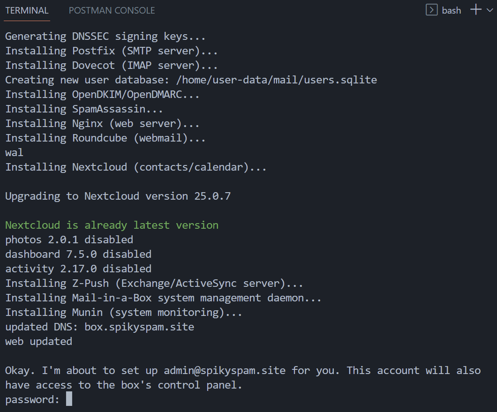

# 04. Mail-in-a-Box


In this Tutorial we are going to setup **Mail-in-a-Box** to have our own **Mail Server**:

## Video

In this video we demonstrate how to install **Mail-in-a-Box** on a fresh Ubuntu Server Virtual Machine (in ProxMox).

[](https://youtu.be/XXXXXXXXXXXXXXXXXXXXXXX)

## Links

- [Ubuntu Server ISO](https://ubuntu.com/download/server)
- [Mail-In-a-Box Site](https://mailinabox.email/)
- [Mail-In-a-Box Github](https://github.com/mail-in-a-box/mailinabox)

## Prerequisites

- [03. Nginx Proxy Manager](../03_nginx_proxy_manager/README.md)

## Create Ubuntu Server VM

1️⃣
- **Login** into your **ProxMox** dashboard
- **Upload** the ISO directly to the Proxmox machine by choosing **Download from URL**
- **Download Ubuntu Server OS** from [here](https://releases.ubuntu.com/22.04.3/ubuntu-22.04.3-live-server-amd64.iso)

2️⃣
- **Create** a new **VM**:
  - Select ISO-file
  - Qemu Agent
  - Graphic card: SPICE
  - 32GB Disk Size
  - 1x1 CPU
  - 2048 RAM
- **Start** the VM

3️⃣
- Follow the **Wizard**:
  - Select your **Language**
  - Continue without Updating
  - Choose **Keyboard Layout**
  - Select to install the **Ubuntu Server**
  - Set your IP address to **192.168.0.31** (*for this tutorial*)
    - **Subnet**: 192.168.0.0/24
    - **Address**: 192.168.0.31
    - **Gateway**: 192.168.0.1
    - **Name servers**: 173.245.58.51,173.245.59.41,198.41.222.173,1.1.1.1,8.8.8.8
  - Set **Username** and **Password**
  - Install the **OpenSSH** server
- Press **Reboot Now** after installation

## Create SSH-key

- Open a **Terminal** and execute following commands to create a **private/public key-pair**:
  ```bash
  ssh-keygen -f $HOME/.ssh/box
  ```

- **Upload** your public key to your VM: 
  ```bash
  ssh-copy-id -i $HOME/.ssh/box.pub spiky-spam@192.168.0.31
  ```

## Setup VM

- **SSH** into your VM as **spiky-spam**
  ```bash
  ssh spiky-spam@192.168.0.31 -i $HOME/.ssh/box
  ```

- **Execute** the following commands to update Ubuntu:
  ```bash
  sudo apt update && sudo apt upgrade -y

  # add your user to the sudo group
  sudo usermod -aG sudo spiky-spam

  ## configure your keyboard (if not set in the installation wizard)
  # sudo dpkg-reconfigure keyboard-configuration
  ```

- **Execute** the following commands to check if your domain has been setup correctly in the file **`/etc/hosname`** for this VM:
  ```bash
  sudo nano /etc/hostname
  ```

- **Change** into your **box domain**:
  ```bash
  # hostname

  box.spikyspam.site
  ```

- Edit **/etc/hosts**:
  ```bash
  sudo nano /etc/hosts
  ```
  ```bash
  # hosts

  127.0.1.1 box.spikyspam.site
  ```

- Edit **/etc/ssh/sshd_config**:
  ```bash
  sudo nano /etc/ssh/sshd_config
  ```

  ```bash
  # sshd_config

  PasswordAuthentication no
  ```

- **Reboot** your VM with the following command:
  ```bash
  sudo reboot
  ```

## Add Glue-Records (Private Name Servers)

- Navigate to your **domain registrar**
- Create 2 Glue-records:
  - **ns1**.box.spikyspam.site ➡️ ***`[YOUR_HOME_WAN_IP]`***
  - **ns2**.box.spikyspam.site ➡️ ***`[YOUR_HOME_WAN_IP]`***

## Add A-Records

- Navigate to [Digital Ocean](https://www.digitalocean.com/)
- Navigate to **Networking** in the **Digital Ocean** menu
- Click the tab **Domains**
- Choose your base domain
- Click **A**
- Create 3 A-records:
  - A1
    - **Hostname**: box
    - **Will Direct To**: 46.101.80.89 (*💡 IP address of the NPM Droplet*)
    - Click **Create Record**
  - A2
    - **Hostname**: autoconfig
    - **Will Direct To**: 46.101.80.89 (*💡 IP address of the NPM Droplet*)
    - Click **Create Record**
  - A3
    - **Hostname**: autodiscover
    - **Will Direct To**: 46.101.80.89 (*💡 IP address of the NPM Droplet*)
    - Click **Create Record**

## Setup NPM Proxy Hosts

- **Domain Names**: 
  - spikyspam.site
  - box.spikyspam.site
  - autoconfig.spikyspam.site
  - autodiscover.spikyspam.site
- **Scheme**: https
- **Forward IP**: ***`[YOUR_HOME_WAN_IP]`***
- **Port**: 443
- Block Common Exploits
- Websockets Support
- **SSL**:
  - Let's Encrypt
  - Force SSL

## Forward port 80, 443, 53, 22, 25, 465, 587, 993, 995 and 4190 on your Router.

💥 Because **Telenet** blocks port **25** for non-business users, I'm unable to send e-mails at the moment. You should be fine when your ISP doens't block port 25.

- Telenet:
  - Login into **mijn-telenet** and navigate to your home network settings:
https://mijn.telenet.be/mijntelenet/homenetwork/
  - Add the following port-forward rules:
    ```
    80 HTTP/TCP
    443 HTTPS/TCP
    53 DNS/BOTH
    22 SSH/BOTH
    25 SMTP/BOTH
    465 SMTP/BOTH
    587 SMTP/BOTH
    993 IMAP/BOTH
    995 POP/BOTH
    4190 Sieve/BOTH
    ```

## Install Mail-in-a-Box

- **SSH** into your VM as **spiky-spam**
  ```bash
  ssh spiky-spam@192.168.0.31 -i $HOME/.ssh/box
  ```

- **Execute** the following command to start the installation of Mail-in-a-Box (*check their website for the up-to-date command*):
  ```bash
  curl -s https://mailinabox.email/setup.sh | sudo -E bash
  ```

- Hit **Enter**
  

- Specify your **admin e-mail** address:
  

- Specify your **domain**:
  

- Choose your **Area**:
  

- Provide a **password** for your admin e-mail account after installation. Set it to the value of the ***`$TF_VAR_MAILINABOX_PASSWORD`*** environment variable in your .***`bash_profile`*** file
  

## Login into Admin Panel

- **Navigate** to https://box.spikyspam.site/admin
- **Provide** your **admin e-mail** address and **password**
- Navigate to **System → TLS (SSL) Certificates** and click the **Provision** button
- Navigate to **System → Status Checks** and click **Enable New-Version Check**

## Login into E-mail Client

- **Navigate** to https://box.spikyspam.site/mail
- **Provide** your Admin e-mail address and **password**
- Click **Login**

- Navigate to **System** ➡️ **Status Checks**
- Click **Enable New-Version Check**
