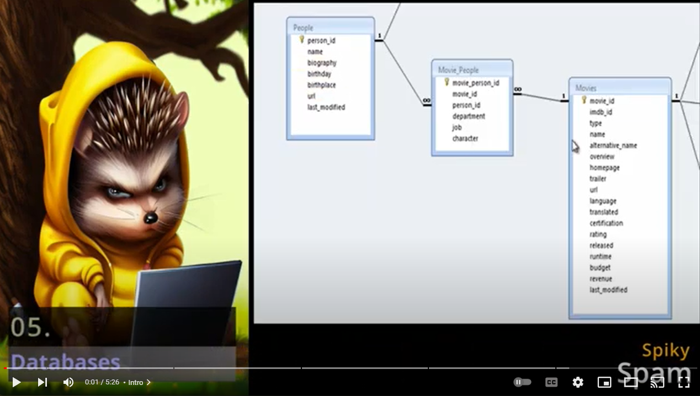

# 05. Databases


In this Tutorial we are going to prepare some **Docker** compose files for a couple of the frequently used databases like **PostgreSQL**, **MySql**, **Redis**, **Prometheus** and **Elastic Search**. We will use those databases in a lot of upcoming Tutorials. We will also install the **pgAdmin** and **phpMyAdmin** tools to have a graphical web interface.

## Video

In this video I demonstrate how to install **PostgreSQL**, **MySql**, **Redis**, **Prometheus** and **Elastic Search** on a [Ubuntu Virtual Machine](../01_setting_up_a_cheap_home_lab_with_proxmox/018_ubuntu/README.md) (*in ProxMox*) inside a **Docker** container.

[](https://youtu.be/8UoNDwNV4R8)

## Links

- [PostgreSQL Site](https://www.postgresql.org)
- ➡️ [pgAdmin Site](https://www.pgadmin.org)
- [MySql Site](https://www.mysql.com)
- ➡️ [phpMyAdmin Site](https://www.phpmyadmin.net)
- [Redis Site](https://redis.com)
- [Prometheus Site](https://prometheus.io)
- [Elastic Search Site](https://www.elastic.co)
- [Background Music](https://freesound.org/people/gis_sweden/sounds/514508)

## Prerequisites

- [04. Mail-in-a-Box](../04_mail_in_a_box/README.md)
  - Its **prerequisites**
  - Its **addendum**

## Clone latest Sources
<a id="latest-sources"></a>
- **Login** into your [Ubuntu VM](../01_setting_up_a_cheap_home_lab_with_proxmox/018_ubuntu/README.md) in [ProxMox](../01_setting_up_a_cheap_home_lab_with_proxmox/018_ubuntu/README.md)
- Get the latest **Sources** from **GitHub**:
  ```bash  
  rm -rf SpikySpamTutorials  
  git clone https://github.com/SpikySpam/Tutorials.git SpikySpamTutorials
 
  # mkdir $HOME/Desktop/Tutorials
  rm -fr $TF_VAR_PATH
  mv -f SpikySpamTutorials/SS $TF_VAR_PATH
  rm -rf SpikySpamTutorials
  ```
- Get the latest [***`.bash_profile`***](../SS/.bash_profile_public) content:
  ```bash  
  cp $TF_VAR_PATH/.bash_profile_public $TF_VAR_PATH/.bash_profile
  nano $TF_VAR_PATH/.bash_profile
  ```
- Check new **[ports.sh](../SS/SS/ports.sh)**
  ```bash  
  nano $TF_VAR_PATH_MAIN/ports.sh
  ```
- Check new **[version.sh](../SS/SS/version/docker/version.sh)**
  ```bash  
  nano $TF_VAR_PATH_MAIN/version/docker/version.sh
  ```

### [PostgreSQL](../SS/SS.APP/docker/postgres/docker-compose.yaml)

- Database
  ```bash
  docker compose -f $TF_VAR_PATH_APP/docker/$TF_VAR_POSTGRES_NAME/docker-compose.yaml up -d
  ```
- Web Interface
  ```bash
  docker compose -f $TF_VAR_PATH_APP/docker/$TF_VAR_PGADMIN_NAME/docker-compose.yaml up -d
  ```

### [MySql](../SS/SS.APP/docker/mysql/docker-compose.yaml)

- Database
  ```bash
  docker compose -f $TF_VAR_PATH_APP/docker/$TF_VAR_MYSQL_NAME/docker-compose.yaml up -d
  ```
- Web Interface
  ```bash
  docker compose -f $TF_VAR_PATH_APP/docker/$TF_VAR_PHPMYADMIN_NAME/docker-compose.yaml up -d
  ```

### [Redis](../SS/SS.APP/docker/redis/docker-compose.yaml)

  ```bash
  docker compose -f $TF_VAR_PATH_APP/docker/$TF_VAR_REDIS_NAME/docker-compose.yaml up -d
  ```

### [Prometheus](../SS/SS.APP/docker/prometheus/docker-compose.yaml)

  ```bash
  docker compose -f $TF_VAR_PATH_APP/docker/$TF_VAR_PROMETHEUS_NAME/docker-compose.yaml up -d
  ```

### [Elastic Search](../SS/SS.APP/docker/elasticsearch/docker-compose.yaml)

  ```bash
  docker compose -f $TF_VAR_PATH_APP/docker/$TF_VAR_ELASTICSEARCH_NAME/docker-compose.yaml up -d
  ```

## Complete Script

These are all the above commands in a single script.
  ```bash
  # PostgreSQL
  docker compose -f $TF_VAR_PATH_APP/docker/$TF_VAR_POSTGRES_NAME/docker-compose.yaml up -d

  # pgAdmin for PostgreSQL
  docker compose -f $TF_VAR_PATH_APP/docker/$TF_VAR_PGADMIN_NAME/docker-compose.yaml up -d

  # MySql
  docker compose -f $TF_VAR_PATH_APP/docker/$TF_VAR_MYSQL_NAME/docker-compose.yaml up -d

  # phpMyAdmin for MySql, Maria, ...
  docker compose -f $TF_VAR_PATH_APP/docker/$TF_VAR_PHPMYADMIN_NAME/docker-compose.yaml up -d

  # Redis
  docker compose -f $TF_VAR_PATH_APP/docker/$TF_VAR_REDIS_NAME/docker-compose.yaml up -d

  # Prometheus
  docker compose -f $TF_VAR_PATH_APP/docker/$TF_VAR_PROMETHEUS_NAME/docker-compose.yaml up -d

  # Elastic Search
  docker compose -f $TF_VAR_PATH_APP/docker/$TF_VAR_ELASTICSEARCH_NAME/docker-compose.yaml up -d
  ```

## Check Docker

- Get **Ownership** of the mounted Docker volume folder (*for **Elastic Search***):
  ```bash  
  sudo chown -R spikyspam:spikyspam $HOME/docker
  ```

- **Check** Containers
  ```bash
  docker ps
  ```

- **Clean** Docker (**skip this**)
  ```bash
  # docker rm -f $(docker ps -a -q)
  # docker system prune -a -f
  # sudo rm -rf $HOME/docker
  ```

## Forward ports on your Router.

  - Add the following port-forward rules:
    ```
    192.168.0.30 ➡️ 5433 # TF_VAR_PGADMIN_PORT_EXT
    192.168.0.30 ➡️ 3307 # TF_VAR_PHPMYADMIN_PORT_EXT
    ```
  - We've created the IP address **192.168.0.30** in [018. ProxMox➡️ Ubuntu](../01_setting_up_a_cheap_home_lab_with_proxmox/018_ubuntu/README.md)

## Add A-Records

- Browse to your [04. Mail-in-a-Box](../04_mail_in_a_box/README.md) address.
- Navigate to **Custom DNS** in the **System** menu
- Create 2 A-records:
  - A1:
    - **Name**: pgadmin
    - **Type**: A
    - **Value**: 46.101.80.89
    - Click **Set Record**
  - A2:
    - **Name**: phpmyadmin
    - **Type**: A
    - **Value**: 46.101.80.89
    - Click **Set Record**

## Setup NPM Proxy Hosts

- Navigate to your [03. Nginx Proxy Manager](../03_nginx_proxy_manager/README.md) address.
- Add 2 Proxy Hosts:
  - Host 1:
    - **Domain Names**: 
      - pgadmin.spikyspam.site ➡️ ***`TF_VAR_PGADMIN_NAME`***
    - **Scheme**: http
    - **Forward IP**: ***`[YOUR_HOME_WAN_IP]`***
    - **Port**: 5433 ➡️ ***`TF_VAR_PGADMIN_PORT_EXT`***
    - Block Common Exploits
    - Websockets Support
    - **SSL**:
      - Let's Encrypt
      - Force SSL
  - Host 2:
    - **Domain Names**: 
      - phpmyadmin.spikyspam.site ➡️ ***`TF_VAR_PHPMYADMIN_NAME`***
    - **Scheme**: http
    - **Forward IP**: ***`[YOUR_HOME_WAN_IP]`***
    - **Port**: 3307 ➡️ ***`TF_VAR_PHPMYADMIN_PORT_EXT`***
    - Block Common Exploits
    - Websockets Support
    - **SSL**:
      - Let's Encrypt
      - Force SSL
