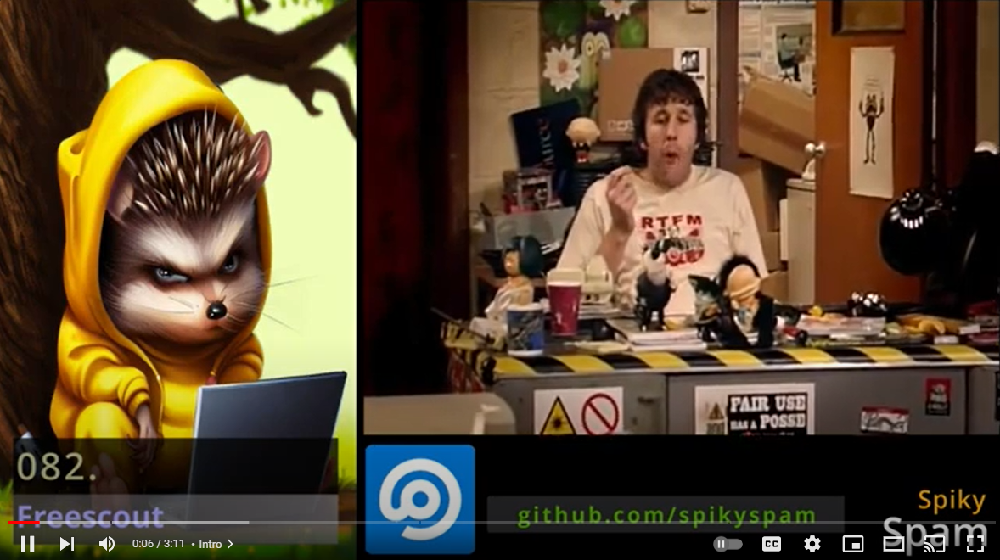

# 082. General Tools ➡️ Freescout


In this Tutorial we are going to prepare a **Docker** compose files for running **Freescout** in a Browser.

## Video

In this Tutorial we are going to install **Freescout** as a **Docker** container in our **Homelab**.

[](https://youtu.be/XXXXXXXXXXXXXXXX)

## Links

- [Freescout Website](https://freescout.net)
- [Freescout GitHub](https://github.com/freescout-helpdesk/freescout)
- 🎺 [Background Music](https://freesound.org/people/XXXXXXXXXXXXXXX)

## Prerequisites

- [02. Setting up our Project Structure](../../02_setting_up_our_project_structure/README.md)
- [03. Nginx Proxy Manager](../../03_nginx_proxy_manager/README.md)
- [04. Mail-in-a-Box](../../04_mail_in_a_box/README.md)

## Preparations

These steps are explained in this **[video](https://youtu.be/8UoNDwNV4R8)**:

1️⃣ [**Forward ports** on your **Router**](../05_databases/README.md#forward-ports-router) \
2️⃣ [Add **A-Records**](../05_databases/README.md#add-a-record) \
3️⃣ [Add NPM **Proxy Hosts**](../05_databases/README.md#npm-proxy-host) \
4️⃣ [**Clone** latest **Sources**](../05_databases/README.md#latest-sources)

## Freescout Installation

You can execute the **[recreate.sh](../../SS/SS.APP/docker/freescout/recreate.sh)** script:

```bash
$TF_VAR_PATH_APP/docker/$TF_VAR_FREESCOUT_NAME/recreate.sh
```

https://github.com/SpikySpam/Tutorials/blob/e162b77665b3bac9a56d2ae7c9003c1a17f42120/SS/SS.APP/docker/freescout/recreate.sh#L1-L22

- ### [Docker Compose](../SS/S#S.APP/docker/freescout/docker-compose.yaml)

  ```bash
    # Clean Previous
    $TF_VAR_COT compose -f $TF_VAR_PATH_APP/docker/$TF_VAR_FREESCOUT_NAME/docker-compose.yaml down
    rm -rf $HOME/docker/$TF_VAR_FREESCOUT_NAME

    # Compose Up
    $TF_VAR_COT compose -f $TF_VAR_PATH_APP/docker/$TF_VAR_FREESCOUT_NAME/docker-compose.yaml up -d --wait --build
  ```

  https://github.com/SpikySpam/Tutorials/blob/e162b77665b3bac9a56d2ae7c9003c1a17f42120/SS/SS.APP/docker/freescout/docker-compose.yaml#L1-L30

