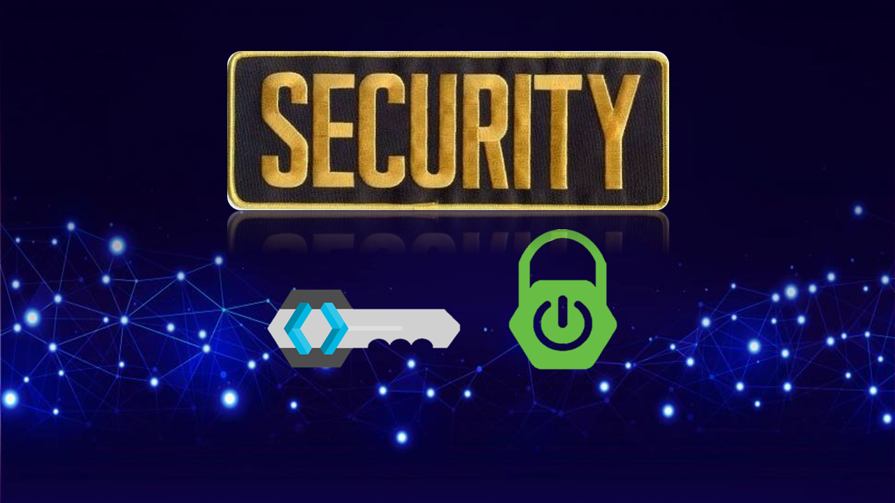

# 091. Security Tools ➡️ Keycloak

In this Tutorial we are going to prepare a **Docker** compose files for running **Keycloak** in a Browser.

## Video

In this Tutorial we are going to install **Keycloak** as a **Docker** container in our **Homelab**.

## Links

- [Keycloak Website](https://keycloak.org)
- [Keycloak GitHub](https://github.com/keycloak/keycloak)
- 🎺 [Background Music](https://freesound.org/people/XXXXXXXXXXXXXXX)

## Prerequisites

- [02. Setting up our Project Structure](../../02_setting_up_our_project_structure/README.md)
- [03. Nginx Proxy Manager](../../03_nginx_proxy_manager/README.md)
- [04. Mail-in-a-Box](../../04_mail_in_a_box/README.md)

## Preparations

These steps are explained in this **[video](https://youtu.be/8UoNDwNV4R8)**:

1️⃣ [**Forward ports** on your **Router**](../05_databases/README.md#forward-ports-router) \
2️⃣ [Add **A-Records**](../05_databases/README.md#add-a-record) \
3️⃣ [Add NPM **Proxy Hosts**](../05_databases/README.md#npm-proxy-host) \
4️⃣ [**Clone** latest **Sources**](../05_databases/README.md#latest-sources)
