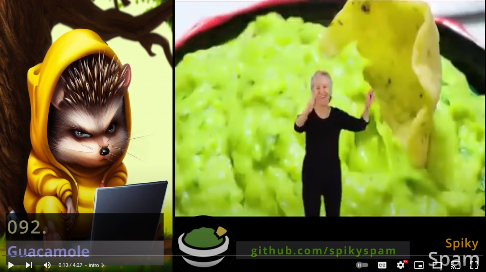

# 092. Security Tools ➡️ Guacamole


In this Tutorial we are going to prepare a **Docker** compose files for running **Guacamole** in a Browser.

## Video

In this Tutorial we are going to install **Guacamole** as a **Docker** container in our **Homelab**.

[](https://youtu.be/fW64ZxgtUHk)

## Links

- [Guacamole Website](https://guacamole.apache.org)
- [Guacamole GitHub](https://github.com/apache/guacamole-client)
- 🎺 [Background Music](https://freesound.org/people/Sunsai/sounds/415804)

## Prerequisites

- [02. Setting up our Project Structure](../../02_setting_up_our_project_structure/README.md)
- [03. Nginx Proxy Manager](../../03_nginx_proxy_manager/README.md)
- [04. Mail-in-a-Box](../../04_mail_in_a_box/README.md)

## Preparations

These steps are explained in this **[video](https://youtu.be/8UoNDwNV4R8)**:

1️⃣ [**Forward ports** on your **Router**](../05_databases/README.md#forward-ports-router) \
2️⃣ [Add **A-Records**](../05_databases/README.md#add-a-record) \
3️⃣ [Add NPM **Proxy Hosts**](../05_databases/README.md#npm-proxy-host) \
4️⃣ [**Clone** latest **Sources**](../05_databases/README.md#latest-sources)

## Guacamole Installation

You can execute the **[recreate.sh](../../SS/SS.APP/docker/guacamole/recreate.sh)** script:

```bash
$TF_VAR_PATH_APP/docker/$TF_VAR_GEACAMOLE_NAME/recreate.sh
```

https://github.com/SpikySpam/Tutorials/blob/b8d32965f9f625776fb34fa3836570392cded154/SS/SS.APP/docker/guacamole/recreate.sh#L1-L13

- ### [Docker Compose](../SS/S#S.APP/docker/guacamole/docker-compose.yaml)

  https://github.com/SpikySpam/Tutorials/blob/b8d32965f9f625776fb34fa3836570392cded154/SS/SS.APP/docker/guacamole/docker-compose.yaml#L1-L71
