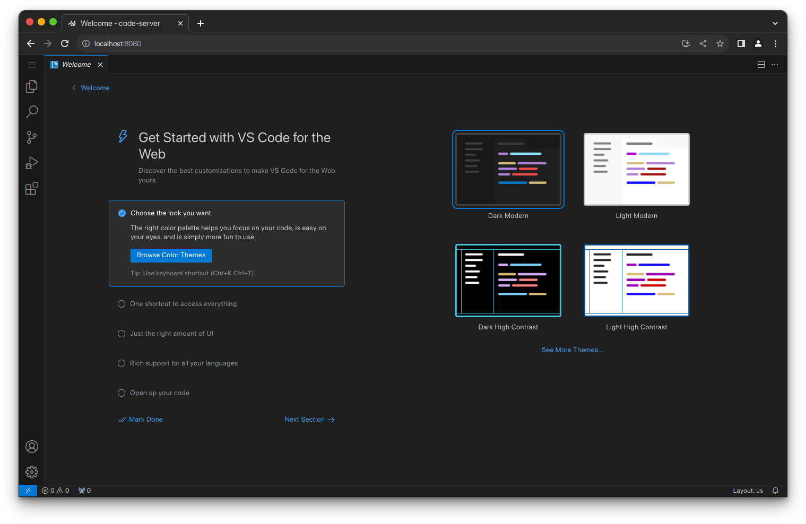

# 105. Development Tools ➡️ Code-Server



In this Tutorial we are going to prepare a **Docker** compose files for running **VS Code** in a Browser.

## Video

In this Tutorial we are going to install **Code-Server** as a **Docker** container in our **Homelab**.

[](https://youtu.be/aatnUqe9jUs)

## Links

- [Code Server Website](https://coder.com)
- [Code Server GitHub](https://github.com/linuxserver/docker-code-server)
- 🎺 [Background Music](https://freesound.org/people/tyops/sounds/401167)

## Prerequisites

- [02. Setting up our Project Structure](../../02_setting_up_our_project_structure/README.md)
- [03. Nginx Proxy Manager](../../03_nginx_proxy_manager/README.md)
- [04. Mail-in-a-Box](../../04_mail_in_a_box/README.md)

## Preparations

These steps are explained in this **[video](https://youtu.be/8UoNDwNV4R8)**:

1️⃣ [**Forward ports** on your **Router**](../05_databases/README.md#forward-ports-router) \
2️⃣ [Add **A-Records**](../05_databases/README.md#add-a-record) \
3️⃣ [Add NPM **Proxy Hosts**](../05_databases/README.md#npm-proxy-host) \
4️⃣ [**Clone** latest **Sources**](../05_databases/README.md#latest-sources)

## GitHub SSH-key

- **Create SSH** private/public keypair

  ```bash
  ssh-keygen -f $HOME/.ssh/$TF_VAR_GITHUB_NAME-$TF_VAR_GITHUB_USER -t ed25519 -C $TF_VAR_GITHUB_EMAIL
  ```

- **Upload** public key content to a new SSH Key at your **[GitHub Settings](https://github.com/settings/keys)**

  ```bash
  cat $HOME/.ssh/$TF_VAR_GITHUB_NAME-$TF_VAR_GITHUB_USER.pub
  ```

## Code Server Installation

You can execute the **[recreate.sh](../../SS/SS.APP/docker/code-server/recreate.sh)** script:

```bash
$TF_VAR_PATH_APP/docker/$TF_VAR_CODESERVER_NAME/recreate.sh
```

https://github.com/SpikySpam/Tutorials/blob/e162b77665b3bac9a56d2ae7c9003c1a17f42120/SS/SS.APP/docker/code-server/recreate.sh#L1-L22

...and skip the following steps until **Update Code Server**, or...

- ### [Docker Compose](../SS/S#S.APP/docker/code-server/docker-compose.yaml)

  ```bash
  # Clean Previous
  $TF_VAR_COT compose -f $TF_VAR_PATH_APP/docker/$TF_VAR_CODESERVER_NAME/docker-compose.yaml down
  rm -rf $HOME/docker/$TF_VAR_CODESERVER_NAME

  # Compose Up
  $TF_VAR_COT compose -f $TF_VAR_PATH_APP/docker/$TF_VAR_CODESERVER_NAME/docker-compose.yaml up -d --wait --build
  ```

  https://github.com/SpikySpam/Tutorials/blob/e162b77665b3bac9a56d2ae7c9003c1a17f42120/SS/SS.APP/docker/code-server/docker-compose.yaml#L1-L30

- ### Setup Code Server Project Environment

  - **Copy** local **Source** to the **Code Server** **workspace-folder**

    ```bash
    mkdir $HOME/docker/$TF_VAR_CODESERVER_NAME/workspace/Tutorials
    cp -a $TF_VAR_PATH $HOME/docker/$TF_VAR_CODESERVER_NAME/workspace/Tutorials
    rm -f $HOME/docker/$TF_VAR_CODESERVER_NAME/workspace/Tutorials/SS/SS/CLI/*.exe
    ```

  - **Call** the solutions **.bash_pofile** from **.bashrc**

    ```bash
    cat >> $HOME/docker/$TF_VAR_CODESERVER_NAME/.bashrc <<EOL
    export TF_VAR_PATH=\$HOME/workspace/Tutorials/SS
    source \$TF_VAR_PATH/.bash_profile
    EOL
    ```

  - **Copy** the private **SSH** key to the **Code Server** **.ssh-folder**

    ```bash
    cp $HOME/.ssh/$TF_VAR_GITHUB_NAME-$TF_VAR_GITHUB_USER $HOME/docker/${TF_VAR_CODESERVER_NAME}/.ssh/$TF_VAR_GITHUB_NAME-$TF_VAR_GITHUB_USER
    ```


## Use Code Server

- **Navigate** to your Code Server address and **Login** with the ***`TF_VAR_CODESERVER_PASSWORD`*** value.

  ```bash
  echo $TF_VAR_CODESERVER_PASSWORD

  $TF_VAR_PATH_HELP/script/browse.sh http://localhost:$TF_VAR_CODESERVER_PORT_EXT
  ```

- **Export** and **Import** VS Code **Profile**

  ```bash
  cp $TF_VAR_PATH/$TF_VAR_GITHUB_USER.code-profile $HOME/docker/$TF_VAR_CODESERVER_NAME/.config/code-server
  ```

- **Change** the solution-folder in **$HOME/.bash_profile**

  😎 This step is optional depending on where you want to code.

  ```bash
  cat >> $HOME/.bash_profile <<EOL
  export TF_VAR_PATH=\$HOME/docker/$TF_VAR_CODESERVER_NAME/workspace/Tutorials/SS
  source \$TF_VAR_PATH/.bash_profile
  EOL
  ```